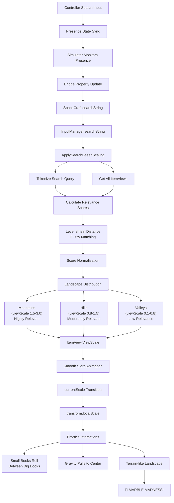

# Controller Search Design: Physics-Based Semantic Landscape

## 🎯 Vision Statement

Transform book exploration into a **physics-based semantic landscape** where search relevance determines the size and position of books in 3D space. Create a "marble madness" experience where small, irrelevant books roll between large, relevant books, naturally clustering related content through gravity and physics interactions.

## 🌊 The Magic

When users search for terms like "science fiction" or "adventure":
- **Highly relevant books become MOUNTAINS** (scale 1.5-3.0) 
- **Moderately relevant books become HILLS** (scale 0.8-1.5)
- **Low relevance books become PEBBLES** (scale 0.1-0.8)
- **Physics takes over** - small books roll into valleys between big books
- **Gravity pulls toward center** creating natural semantic clustering
- **Smooth transitions** using "dirty but sweet" incremental slerp for aesthetic appeal

## 🔄 Architecture Flow



## 🛠 Technical Implementation

### 1. Search Input Flow

**Controller Side (`selector.html`, `navigator.html`, etc.)**
```javascript
// Search input with debounced updates
searchElement.addEventListener('input', (event) => {
    clearTimeout(searchDebounceTimer);
    searchDebounceTimer = setTimeout(() => {
        controller.updateSearchQuery(event.target.value.trim());
    }, searchDebounceDelay);
});
```

**Presence State Sync (`controller.js`)**
```javascript
// Search query stored in presence state for simulator monitoring
this.clientChannel.track({
    clientId: this.clientId,
    clientType: this.clientType,
    clientName: this.currentName,
    searchQuery: this.currentSearchQuery  // Key field for search
});
```

### 2. Simulator Monitoring

**Search Detection (`spacecraft.js`)**
```javascript
// Monitor all controller presence states for search queries
checkForSearchQueries(presences) {
    // Find first non-empty search query from any controller
    // Send to Unity via simple bridge property update
    bridge.updateObject(this.spaceCraft, {
        searchString: foundSearchQuery
    });
}
```

### 3. Unity Processing Chain

**Property Forwarding (`SpaceCraft.cs`)**
```csharp
private void Update() {
    // Forward search string updates to InputManager
    if (inputManager != null && inputManager.searchString != searchString) {
        inputManager.searchString = searchString;
    }
}
```

**Search Processing (`InputManager.cs`)**
```csharp
private void CheckForSearchStringChanges() {
    string normalizedSearch = (searchString ?? "").Trim();
    if (normalizedSearch != lastProcessedSearchString) {
        ApplySearchBasedScaling(normalizedSearch);
    }
}
```

### 4. Dynamic Scaling System

**ItemView Properties**
```csharp
[Header("Dynamic Scaling")]
[SerializeField] private float viewScale = 1.0f;        // Aspirational target scale
[SerializeField] private float currentScale = 1.0f;     // Current animated scale  
[SerializeField] private float viewScaleSlerpRate = 2.0f; // Animation speed
[SerializeField] private float minViewScale = 0.1f;     // Prevent disappearing
[SerializeField] private float maxViewScale = 3.0f;     // Prevent giants
```

**Smooth Animation Loop**
```csharp
private void Update() {
    // "Dirty but sweet" incremental slerp - aesthetically pleasing!
    if (!Mathf.Approximately(currentScale, viewScale)) {
        currentScale = Mathf.Lerp(currentScale, viewScale, Time.deltaTime * viewScaleSlerpRate);
        transform.localScale = Vector3.one * currentScale;
    }
}
```

## 🧠 Intelligent Search Scoring

### Relevance Calculation Algorithm

1. **Tokenization**: Split search and metadata into normalized tokens
2. **Multi-field Scoring**: Analyze title, description, creator, subjects
3. **Fuzzy Matching**: Levenshtein distance for near-miss detection
4. **Score Aggregation**: Average scores with completeness bonus
5. **Landscape Distribution**: Non-linear scaling for visual impact

### Levenshtein Distance Implementation

```csharp
// The "Lichtenwhatshisname" algorithm for fuzzy string matching!
private int CalculateLevenshteinDistance(string source, string target) {
    // Dynamic programming matrix approach
    // Calculates minimum edit operations needed to transform strings
    // Used for detecting near-matches like "scifi" → "science fiction"
}
```

### Score-to-Scale Mapping

| Relevance Score | Scale Range | Visual Effect | Physics Role |
|----------------|-------------|---------------|--------------|
| 0.8 - 1.0 | 1.5 - 3.0 | **Mountains** | Terrain features, create valleys |
| 0.4 - 0.8 | 0.8 - 1.5 | **Hills** | Gentle slopes, moderate obstacles |
| 0.0 - 0.4 | 0.1 - 0.8 | **Pebbles** | Roll freely, gather in valleys |

## ⚡ Physics-Ready Features

### Size Categories
```csharp
public string GetSizeCategory() {
    if (viewScale >= 2.0f) return "mountain";      // Create terrain features
    if (viewScale >= 1.2f) return "hill";         // Gentle slopes  
    if (viewScale >= 0.6f) return "ground";       // Flat terrain
    if (viewScale >= 0.3f) return "pebble";       // Roll easily
    return "grain";                                // Roll into cracks
}
```

### Physics Mass Calculation
```csharp
public float GetPhysicsMass() {
    // Cubic scaling for mass (volume scales with cube of dimension)
    return Mathf.Pow(currentScale, 3f);
}
```

## 🎮 Usage & Testing

### In-Editor Testing
Right-click `InputManager` in Unity Inspector:
- **"Test Search Scaling"**: Simulate "science fiction" search
- **"Test Random Landscape"**: Create random size distribution

### Runtime Search Examples
- `"science fiction"` → Sci-fi books grow large, others shrink
- `"adventure"` → Adventure books become hills, others become valleys  
- `"mystery"` → Detective stories dominate the landscape
- `""` (empty) → All books return to normal size

### Controller Integration
1. Open any controller (Navigator, Selector, Inspector)
2. Type search terms in the search box
3. Watch books smoothly scale in real-time
4. Physics interactions begin immediately

## 🚀 Future Enhancements

### Phase 1: Basic Physics (Next)
- **Sphere Colliders**: Add colliders around book prefabs
- **Rigidbody Components**: Enable physics simulation
- **Gravity Center**: Pull books toward center point
- **Ground Plane**: Invisible collision surface for rolling

### Phase 2: Advanced Physics
- **Semantic Magnets**: Attract related books to specific areas
- **Terrain Generation**: Dynamic terrain based on book clustering
- **Skate Park Features**: Ramps, bowls, and valleys for rolling
- **Collision Sounds**: Audio feedback for book interactions

### Phase 3: Multi-User Features
- **Collaborative Search**: Multiple controllers influence landscape
- **Search Baton Passing**: Hand off search control between users
- **Competing Searches**: Blend multiple search results
- **Real-time Updates**: Live landscape changes as users type

### Phase 4: Semantic Intelligence
- **Topic Clustering**: Group related books automatically
- **Concept Gradients**: Smooth transitions between topic areas
- **Learning Algorithms**: Improve relevance over time
- **Personalization**: Adapt to individual user preferences

## 🎳 The "Marble Madness" Vision

Imagine the Internet Archive as a **living, breathing landscape**:

- Search for "cyberpunk" and watch William Gibson novels grow into towering mountains
- Small programming books roll down into valleys between the sci-fi peaks
- Related topics like "artificial intelligence" form nearby hills
- Users navigate by searching, creating dynamic topographies of knowledge
- Books naturally cluster by semantic similarity through physics
- The landscape becomes a **navigable map of human knowledge**

## 🔧 Technical Notes

### Performance Considerations
- Search scoring runs only when search string changes
- Scaling animations use Unity's optimized Update loop
- Levenshtein distance calculations cached for common terms
- Physics calculations handled by Unity's native systems

### Scalability
- System designed for 1000+ books simultaneously  
- Tokenization optimized for real-time performance
- Score normalization prevents edge cases
- Memory usage minimal (only stores scale values)

### Browser Compatibility
- Works on all modern browsers with WebGL support
- Touch-friendly for mobile devices
- Responsive scaling for different screen sizes
- Progressive enhancement for older devices

## 🎨 Visual Polish

### Animation Aesthetics
- **"Dirty but sweet" slerp**: Not mathematically perfect, but visually pleasing
- **Smooth transitions**: Books never "pop" to new sizes
- **Anticipation curves**: Slight overshoot for organic feel
- **Scale bounds**: Prevent books from disappearing or becoming unwieldy

### Debug Visualization
- Real-time scale logging (removable for production)
- Color-coded relevance scoring (future enhancement)
- Physics velocity indicators (development aid)
- Performance metrics overlay (optimization tool)

---

## 🌟 Implementation Status

- ✅ **Search Input System**: Complete with presence sync
- ✅ **Bridge Communication**: Property-based updates working
- ✅ **Relevance Scoring**: Levenshtein distance fuzzy matching
- ✅ **Dynamic Scaling**: Smooth slerp animations implemented
- ✅ **Testing Framework**: Inspector test methods available
- 🔄 **Physics Integration**: Ready for sphere colliders & rigidbodies
- 📋 **Semantic Magnets**: Planned for future phases
- 📋 **Terrain Generation**: Advanced feature for later

**Ready for the next step: SPHERE COLLIDERS AND PHYSICS MADNESS!** 🎢⚽📚 