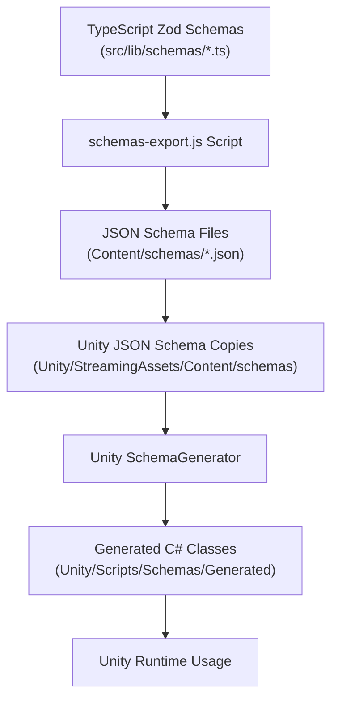

# Schema System Overview

The schema system provides a robust, cross-platform data modeling solution ensuring type safety and consistency between TypeScript and Unity C# codebases.

## Core Components

### 1. Source of Truth (Zod Schemas)
- Located in `SvelteKit/BackSpace/src/lib/schemas/*.ts`
- Defines core data structures using Zod for TypeScript type safety
- Uses a "description hack" to embed metadata (like type converters) in property descriptions
- Handles variations in data formats (e.g., fields that can be strings or arrays)

### 2. Schema Export Pipeline
- `schemas-export.js` converts Zod schemas to JSON Schema format
- Processes descriptions to extract metadata into `x_meta` fields
- Outputs processed JSON schemas to `Content/schemas` (SSOT)
- Maintains strict rules for runtime safety, especially for WebGL/IL2CPP compatibility

### 3. Unity Integration
- JSON schemas are copied to Unity's `StreamingAssets/Content/schemas`
- `SchemaGenerator.cs` generates C# classes from JSON schemas
- Generated classes avoid reflection-based serialization for WebGL compatibility
- Uses custom converters for type-safe string handling

## Directory Structure
```
BackSpace/
└── src/
    └── lib/
        └── schemas/         # TypeScript schema definitions

Content/
└── schemas/                # Central JSON schema repository 

Unity/SpaceCraft/Assets/
├── StreamingAssets/
│   └── Content/
│       └── schemas/        # Unity copy of JSON schemas
└── Scripts/
    └── Schemas/
        └── Generated/      # Generated C# classes
```

## Schema Pipeline Flow


## Key Features
- Type-safe data modeling across platforms
- Runtime validation at all levels
- WebGL/IL2CPP compatibility through careful code generation
- Metadata-driven type conversion
- Direct property access without reflection
- Support for complex types and nested structures

## WebGL/IL2CPP Compatibility Guidelines

The schema system is designed to work reliably in WebGL/IL2CPP builds, which have significant limitations with reflection-based code. Follow these critical guidelines:

### Critical Safety Rules
- **No reflection-based JSON.NET methods in runtime code**
  - **❌ AVOID**: `JsonConvert.DeserializeObject<T>()` 
  - **✅ USE**: `JToken.Parse()` with explicit type handling
- **No attribute-based serialization**
  - **❌ AVOID**: `[JsonProperty]`, `[JsonConverter]` attributes
  - **✅ USE**: Direct property access and manual JSON processing
- **Explicitly handle types**
  - **❌ AVOID**: Automatic type conversion methods
  - **✅ USE**: Explicit type checking and conversion

### Why This Matters
Reflection-based methods often work in the Unity Editor but **will crash catastrophically at runtime in WebGL builds**. The generated schema classes avoid these issues by using:

1. Direct property access without reflection
2. Manual JSON parsing and serialization
3. Explicit type checking and conversion
4. Custom converters implemented without reflection

### Example of Safe Approach
Instead of using generic deserialization, the schema system uses explicit token parsing:

```csharp
// ✅ WebGL-safe approach
JToken token = JToken.Parse(jsonContent);
if (token is JArray array)
{
    List<string> items = new List<string>();
    foreach (JToken item in array)
    {
        if (item.Type == JTokenType.String)
        {
            items.Add(item.Value<string>());
        }
    }
}
```

## Internet Archive Metadata Handling
1. **Field Categorization**:
   - Essential IA fields as top-level schema properties
   - Additional properties preserved in the C# implementation's `extraFields`
2. **Field Normalization**:
   - String fields normalized to always be strings
   - Array fields normalized to always be arrays
   - Optional fields have safe defaults
3. **Type Converters**:
   - `StringOrNullToString`: Handles null/undefined
   - `StringOrStringArrayToString`: Handles string/array variations
   - `NullOrStringToStringArray`: Ensures string arrays
   - `StringToDateTime`: Handles date/time conversions

## Extra Fields Implementation

The schema system provides a special mechanism for handling undefined properties in the Unity C# implementation:

1. **C# Implementation Only**:
   - `extraFields` only exists in the Unity C# side
   - It is **NOT** exposed in Zod schemas or JSON schemas
   - It's implemented as a JObject in the SchemaGeneratedObject base class

2. **Automatic Field Management**:
   - `ImportExtraFields()` captures any undefined fields from JSON
   - `ExportToJson()` includes both known properties and extraFields
   - This happens transparently without additional code

## Schema Update Workflow

When updating schemas, follow this process:

1. **Update Zod Definition**:
   - Edit TypeScript schemas in `SvelteKit/BackSpace/src/lib/schemas/`
   - Use Zod's type system for proper TypeScript integration
   - Embed converter information in descriptions when needed

2. **Generate Schemas**:
   ```bash
   cd SvelteKit/BackSpace
   npm run schemas:generate-all
   ```
   This command:
   - Exports JSON Schemas from TypeScript
   - Copies them to Content/schemas
   - Copies them to Unity's StreamingAssets

3. **Update in Unity**:
   - Open Unity and navigate to Tools > Import JSON Schema
   - This generates the C# classes from the JSON Schema

4. **Update Code**:
   - Update any TypeScript code using the schema types
   - Existing Unity code will work with updated schemas automatically

## Troubleshooting

1. **Directory Issues**:
   ```bash
   mkdir -p SvelteKit/BackSpace/schemas Content/schemas
   ```

2. **Debug Scripts**:
   ```bash
   npm run path:debug
   npm run schemas:debug
   ```

3. **Unity Issues**:
   - Delete generated C# files
   - Restart Unity
   - Re-run import process

## Schema Models and Core Types

### Collection Schema
- **id**: Unique identifier for the collection
- **name**: Display name of the collection
- **query**: Internet Archive query string
- **description**: Detailed collection description
- **totalItems**: Count of items in the collection
- **lastUpdated**: Timestamp of last update

### Item Schema
- **id**: Unique identifier for the item
- **title**: Display title of the item
- **creator**: Original creator/author
- **description**: Detailed item description
- **mediaType**: Type of media (text, video, audio, etc.)
- **date**: Publication or creation date
- **files**: Associated files for this item

## Best Practices
1. **Incremental Schema Changes**: Make small, incremental changes
2. **Documentation**: Document all schema changes in a changelog
3. **Test Coverage**: Ensure validation tests for all platforms
4. **Strict Validation**: Use stricter validation during development
5. **Follow Naming Conventions**: Be consistent with property naming
6. **Keep Schemas DRY**: Extract common patterns into reusable schema components
7. **Test WebGL Early**: Catch reflection-related issues early

## Resources
- [Zod Documentation](https://zod.dev/)
- [JSON Schema](https://json-schema.org/)
- [NJsonSchema](https://github.com/RicoSuter/NJsonSchema)
- [JSON.NET](https://www.newtonsoft.com/json)

## Integration with Content Pipeline

The schema system integrates directly with the Content Pipeline, enabling validation and conversion of content at various pipeline stages. See [README-PIPELINE.md](../SvelteKit/BackSpace/README-PIPELINE.md) for more details on how schemas are used in the content processing workflow.