# Supabase Integration with Bridge

## Overview

This document outlines how Supabase is integrated with the Bridge system to enable real-time multiplayer experiences, mobile controller integration, and synchronized state management across devices.

## What is Supabase?

Supabase is an open-source Firebase alternative providing:
- PostgreSQL database
- Authentication
- Real-time subscriptions
- Storage
- Edge Functions
- Vector embeddings

For our Bridge integration, we primarily leverage the real-time capabilities and presence system to create multi-device interactive experiences.

## Current Implementation

Our current implementation enables multiple mobile devices to control a shared Unity WebGL experience:

### Architecture

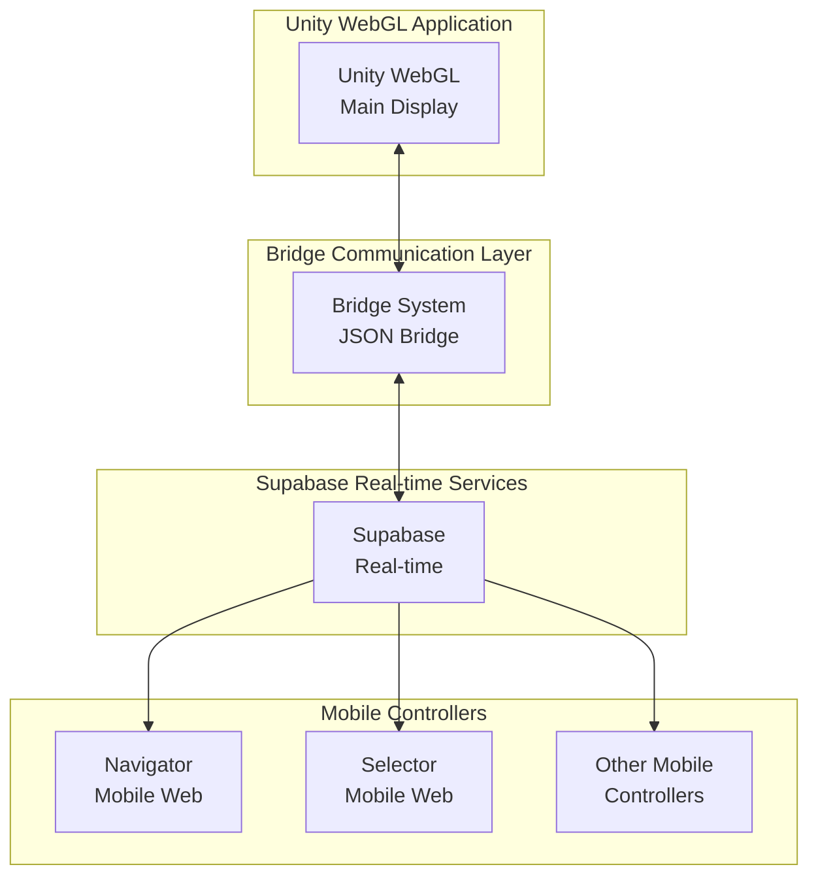

### Connection Flow

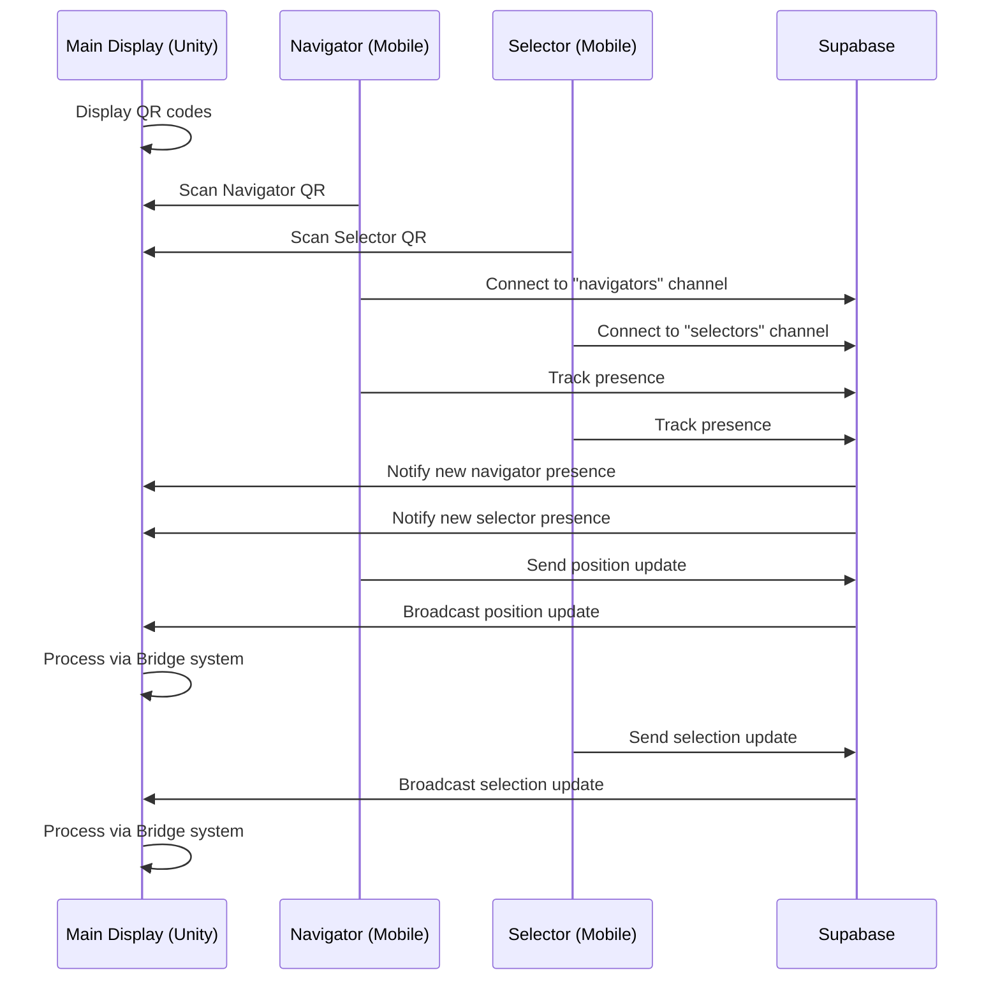

### Current Capabilities

- **Navigation Control**: Pan and zoom functionality through the "navigators" channel
- **Selection Control**: Object selection through the "selectors" channel
- **Presence Tracking**: Live tracking of online users in each role
- **QR-based Pairing**: Easy connection through QR code scanning
- **Mobile-Optimized Input**: Touch and gesture controls optimized for phones

### Code Implementation

The current implementation uses:

1. **Supabase Channel Creation**:
```javascript
// From index.html:
const navigatorChannel = client.channel("navigators")
const selectorChannel = client.channel("selectors")
```

2. **Event Broadcasting**:
```javascript
// From navigator.html:
channel.send({
  type: 'broadcast',
  event: 'pos',
  payload: { x: relX, y: relY }
})
```

3. **Presence Tracking**:
```javascript
// From navigator.html:
channel.track({
  user,
  online_at: new Date().toISOString()
});
```

4. **Event Listening**:
```javascript
// From index.html:
navigatorChannel
  .subscribe((status) => {
    console.log('subscribe', status)
    if (status === 'SUBSCRIBED') {
      subscribed = true;
    }
  })
  .on(
    'broadcast',
    { event: 'pos' },
    (data) => handlePos(data.payload)
  )
  .on('presence', { event: 'sync' }, () => {
    const newState = navigatorChannel.presenceState()
    handlePresence('navigator', newState)
  })
```

## Enhancing Bridge with Supabase

To deepen the integration between Bridge and Supabase, we should implement:

### 1. Supabase-Bridge Object Binding

Create a system that automatically binds Supabase real-time updates to Bridge objects:

```javascript
// Implementation for supabase-bridge.js
bridge.bindWithSupabase = function(objectId, config) {
  const object = this.objects[objectId];
  if (!object) return null;
  
  // Create Supabase channel
  const channel = supabase.channel(`object-${objectId}`);
  
  // Set up listeners for changes
  channel.on('broadcast', { event: 'update' }, (data) => {
    bridge.updateObject(objectId, data.payload.properties);
  });
  
  // Create interest for property changes
  bridge.updateInterests(objectId, {
    PropertyChanged: {
      query: Object.fromEntries(
        Object.keys(config.properties).map(key => [key, config.properties[key]])
      ),
      handler: (obj, data) => {
        // Broadcast changes to Supabase
        channel.send({
          type: 'broadcast',
          event: 'update',
          payload: { properties: data }
        });
      }
    }
  });
  
  // Subscribe to channel
  channel.subscribe();
  
  return channel;
};
```

### 2. Room-Based Multi-Player Coordination

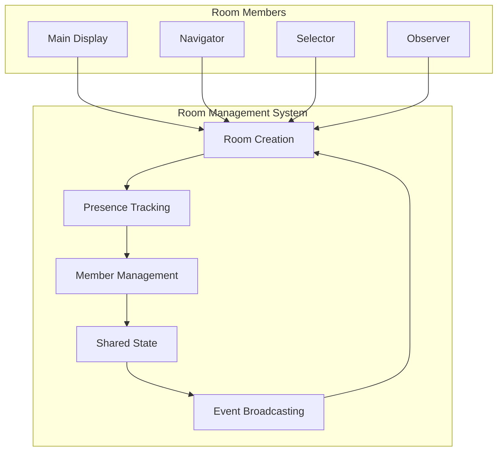

Implementation:

```javascript
bridge.createRoom = function(roomId, config) {
  const channel = supabase.channel(`room-${roomId}`);
  
  // Track this client's presence
  channel.subscribe((status) => {
    if (status === 'SUBSCRIBED') {
      channel.track({
        client_id: config.clientId,
        role: config.role,
        meta: config.meta || {},
        joined_at: new Date().toISOString()
      });
    }
  });
  
  // Handle other clients joining/leaving
  channel.on('presence', { event: 'sync' }, () => {
    const state = channel.presenceState();
    if (config.onPresenceChanged) {
      config.onPresenceChanged(state);
    }
  });
  
  return {
    id: roomId,
    channel: channel,
    broadcast: (event, payload) => {
      channel.send({
        type: 'broadcast',
        event: event,
        payload: payload
      });
    },
    leave: () => {
      channel.untrack();
      channel.unsubscribe();
    }
  };
};
```

### 3. Enhanced Mobile Controller Capabilities

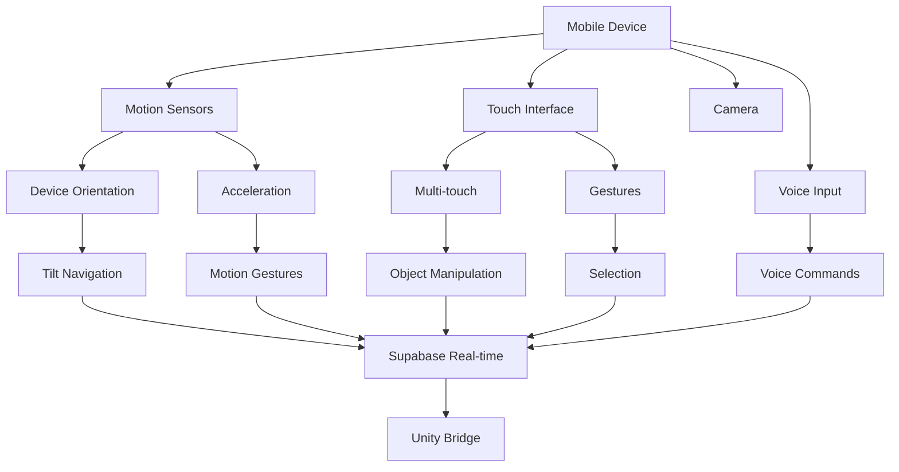

#### Motion and Orientation Controls

```javascript
// Add to navigator.html or selector.html
window.addEventListener('deviceorientation', (event) => {
  // Handle device orientation changes
  const alpha = event.alpha; // Z-axis rotation [0,360)
  const beta = event.beta;   // X-axis rotation [-180,180)
  const gamma = event.gamma; // Y-axis rotation [-90,90)
  
  channel.send({
    type: 'broadcast',
    event: 'orientation',
    payload: { alpha, beta, gamma }
  });
}, true);

window.addEventListener('devicemotion', (event) => {
  // Handle acceleration including gravity
  const x = event.accelerationIncludingGravity.x;
  const y = event.accelerationIncludingGravity.y;
  const z = event.accelerationIncludingGravity.z;
  
  channel.send({
    type: 'broadcast',
    event: 'motion',
    payload: { x, y, z }
  });
}, true);
```

#### Multi-Touch Gesture Recognition

Extend the existing pointer event handling to support complex gestures:

```javascript
// Extend the existing code in navigator.html or selector.html
let currentGesture = null;
let prevEvCache = [];

// Detect rotation gesture
function detectRotation(ev0, ev1, prevEv0, prevEv1) {
  if (!prevEv0 || !prevEv1) return 0;
  
  const angle1 = Math.atan2(ev1.clientY - ev0.clientY, ev1.clientX - ev0.clientX);
  const angle2 = Math.atan2(prevEv1.clientY - prevEv0.clientY, prevEv1.clientX - prevEv0.clientX);
  
  return (angle1 - angle2) * 180 / Math.PI;
}

// Modify the existing pointermoveHandler
function pointermoveHandler(ev) {
  // Find this event in the cache and update its record
  const index = evCache.findIndex(
    (cachedEv) => cachedEv.pointerId === ev.pointerId,
  );
  evCache[index] = ev;

  // If two pointers are down, check for gestures
  if (evCache.length === 2 && prevEvCache.length === 2) {
    // Calculate the distance for pinch
    const curDiff = Math.abs(evCache[0].clientX - evCache[1].clientX);
    const prevDiff = Math.abs(prevEvCache[0].clientX - prevEvCache[1].clientX);
    
    // Calculate rotation
    const rotation = detectRotation(evCache[0], evCache[1], prevEvCache[0], prevEvCache[1]);
    
    // Send complex gesture data
    sendEvent('gesture', { 
      type: 'complex',
      rotation,
      pinch: curDiff - prevDiff,
      position: {
        x: (evCache[0].clientX + evCache[1].clientX) / 2,
        y: (evCache[0].clientY + evCache[1].clientY) / 2
      }
    });
  }
  
  // Store cache for next comparison
  prevEvCache = [...evCache];
  
  // Continue with original implementation...
}
```

#### Voice Commands and Speech Recognition

```javascript
// Add to navigator.html or selector.html
function setupSpeechRecognition() {
  const SpeechRecognition = window.SpeechRecognition || window.webkitSpeechRecognition;
  if (!SpeechRecognition) {
    console.log("Speech recognition not supported");
    return;
  }
  
  const recognition = new SpeechRecognition();
  recognition.continuous = false;
  recognition.lang = 'en-US';
  recognition.interimResults = false;
  
  recognition.onresult = (event) => {
    const transcript = event.results[0][0].transcript;
    console.log('Voice command:', transcript);
    
    channel.send({
      type: 'broadcast',
      event: 'voice',
      payload: { transcript }
    });
  };
  
  // Add voice command button to UI
  const voiceButton = document.createElement('button');
  voiceButton.innerText = 'Voice Command';
  voiceButton.onclick = () => {
    recognition.start();
  };
  document.body.appendChild(voiceButton);
}

setupSpeechRecognition();
```

### 4. User Interface for State Management

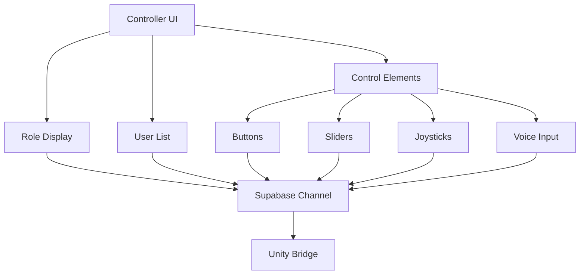

Implementation:

```javascript
// Add to navigator.html or selector.html
function createControllerUI(config) {
  const container = document.createElement('div');
  container.className = 'controller-ui';
  
  // Add role title
  const title = document.createElement('h2');
  title.innerText = config.title;
  container.appendChild(title);
  
  // Add user list from presence data
  const userList = document.createElement('div');
  userList.className = 'user-list';
  container.appendChild(userList);
  
  // Update user list periodically
  function updateUserList() {
    const state = channel.presenceState();
    userList.innerHTML = '';
    
    Object.entries(state).forEach(([key, presences]) => {
      presences.forEach(presence => {
        const userItem = document.createElement('div');
        userItem.className = 'user-item';
        userItem.innerText = presence.user || 'Unknown';
        userList.appendChild(userItem);
      });
    });
  }
  
  // Create UI controls based on config
  config.controls.forEach(control => {
    const element = document.createElement(control.type);
    element.className = 'control ' + control.name;
    
    if (control.type === 'button') {
      element.innerText = control.label;
      element.onclick = () => {
        channel.send({
          type: 'broadcast',
          event: control.event,
          payload: control.payload || {}
        });
      };
    }
    
    container.appendChild(element);
  });
  
  document.body.appendChild(container);
  
  // Listen for presence changes
  channel.on('presence', { event: 'sync' }, updateUserList);
  
  return container;
}
```

### 5. Natural Language Interface

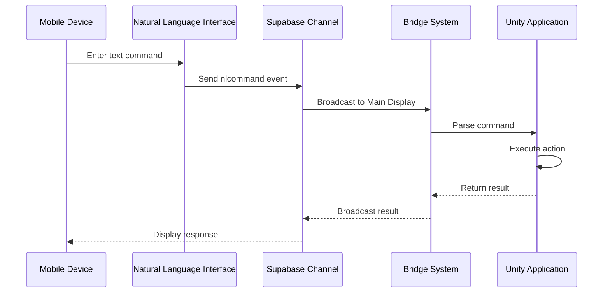

Implementation:

```javascript
// Add to navigator.html or selector.html
function createNLInterface() {
  const container = document.createElement('div');
  container.className = 'nl-interface';
  
  const input = document.createElement('input');
  input.type = 'text';
  input.placeholder = 'Enter a command...';
  container.appendChild(input);
  
  const sendButton = document.createElement('button');
  sendButton.innerText = 'Send';
  container.appendChild(sendButton);
  
  function processCommand() {
    const command = input.value.trim();
    if (!command) return;
    
    // Send raw text command
    channel.send({
      type: 'broadcast',
      event: 'nlcommand',
      payload: { command }
    });
    
    // Clear input
    input.value = '';
  }
  
  sendButton.onclick = processCommand;
  input.onkeypress = (e) => {
    if (e.key === 'Enter') processCommand();
  };
  
  document.body.appendChild(container);
  return container;
}
```

## Implementation Plan

### Phase 1: Core Supabase-Bridge Integration

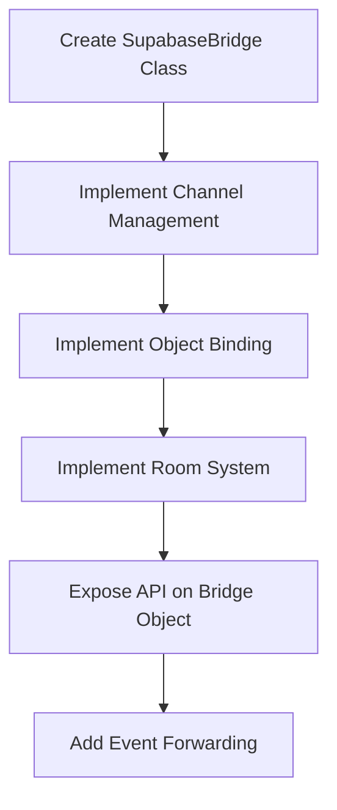

Implementation:

```javascript
// In a new file: supabase-bridge.js
class SupabaseBridge {
  constructor(bridge, supabaseClient) {
    this.bridge = bridge;
    this.supabase = supabaseClient;
    this.channels = {};
    this.roomBindings = {};
    this.objectBindings = {};
    
    // Expose methods on Bridge
    bridge.createRoom = this.createRoom.bind(this);
    bridge.joinRoom = this.joinRoom.bind(this);
    bridge.bindWithSupabase = this.bindWithSupabase.bind(this);
  }
  
  // Implementation of methods described earlier
  // ...
}

// Initialize in main script
window.supaBridge = new SupabaseBridge(window.bridge, supabase);
```

### Phase 2: Enhanced Mobile Controllers

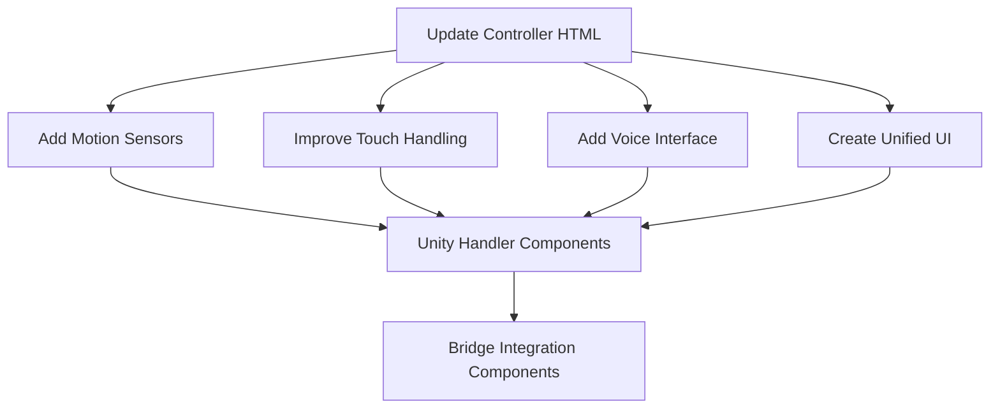

#### Unity Bridge Object Integration

To handle new input from Supabase on the Unity side, we need to create appropriate BridgeObject components:

```javascript
// Create motion tracker in Unity
world.motionTracker = bridge.createObject({
  prefab: 'Prefabs/Tracker', 
  obj: {
    // Store motion state
    orientation: { alpha: 0, beta: 0, gamma: 0 },
    motion: { x: 0, y: 0, z: 0 }
  },
  interests: {
    MotionUpdate: {
      query: {
        deviceId: "deviceId",
        orientation: "orientation",
        motion: "motion"
      },
      handler: (obj, results) => {
        // Update stored state
        obj.deviceId = results.deviceId;
        obj.orientation = results.orientation;
        obj.motion = results.motion;
        
        // Apply to camera or other objects
        bridge.updateObject(world.camera, {
          "transform/rotation": calculateRotationFromOrientation(results.orientation)
        });
      }
    }
  }
});

// Create voice command handler in Unity
world.voiceCommandHandler = bridge.createObject({
  prefab: 'Prefabs/Tracker',
  obj: {
    // Command processing methods
    parseCommand: (text) => {
      // Simple command parsing
      const words = text.toLowerCase().split(' ');
      const verb = words[0];
      const subject = words.slice(1).join(' ');
      
      return { verb, subject };
    },
    
    executeCommand: (command) => {
      // Execute the parsed command
      switch(command.verb) {
        case 'go':
        case 'move':
          navigateTo(command.subject);
          break;
        case 'select':
        case 'choose':
          selectItem(command.subject);
          break;
        // Add more commands
      }
    }
  },
  interests: {
    VoiceCommand: {
      query: {
        deviceId: "deviceId",
        transcript: "transcript"
      },
      handler: (obj, results) => {
        const command = obj.parseCommand(results.transcript);
        obj.executeCommand(command);
      }
    }
  }
});
```

### Phase 3: Advanced Multi-Player Features

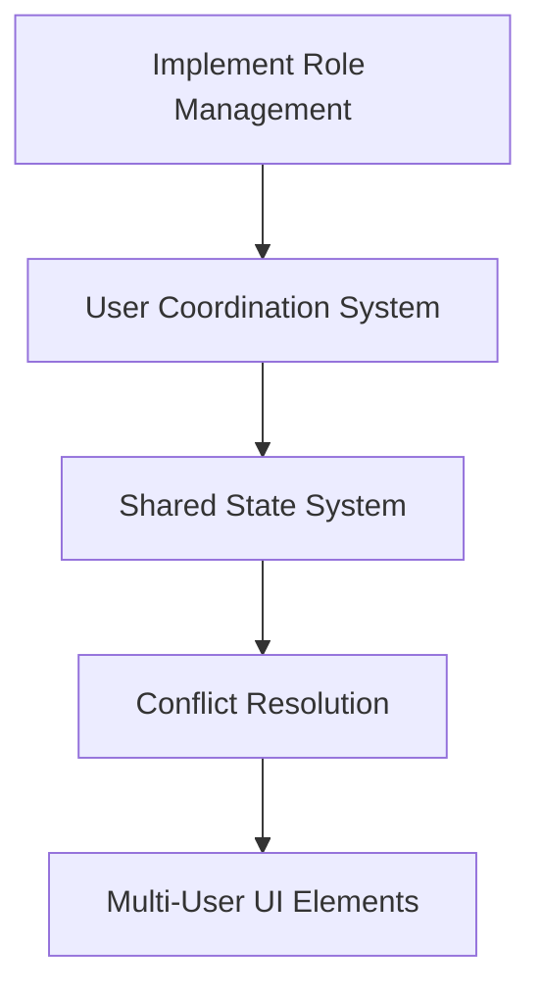

## Mobile Controller Design Patterns

### Magic Carpet Control Pattern

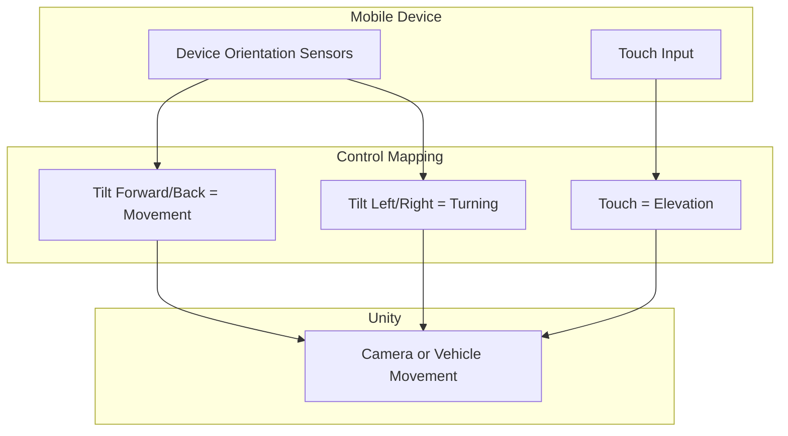

Implementation:

```javascript
// On mobile controller
window.addEventListener('deviceorientation', (event) => {
  // Normalize values to [-1, 1] range
  const pitch = Math.max(-45, Math.min(45, event.beta)) / 45;  // Forward/back
  const roll = Math.max(-45, Math.min(45, event.gamma)) / 45;  // Left/right
  
  channel.send({
    type: 'broadcast',
    event: 'carpet',
    payload: { pitch, roll }
  });
}, true);

// In Unity through Bridge
function handleCarpetControl(payload) {
  const speed = 0.1;
  bridge.updateObject(world.camera, {
    "transform/position": {
      x: { op: "add", value: payload.roll * speed },
      z: { op: "add", value: payload.pitch * speed }
    }
  });
}
```

### Collaborative Control Pattern

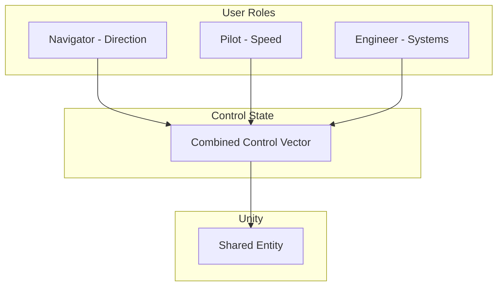

Implementation:

```javascript
// Each controller subscribes to different control aspects
const myRole = getAssignedRole(); // 'direction', 'speed', 'altitude', etc.

// Only send control updates for your assigned role
function sendControlUpdate(type, value) {
  if (type !== myRole) return;
  
  channel.send({
    type: 'broadcast',
    event: 'collaborative',
    payload: { 
      role: myRole,
      value: value
    }
  });
}

// In Unity through Bridge
const controlState = {
  direction: 0,
  speed: 0,
  altitude: 0
};

function handleCollaborativeControl(payload) {
  // Update just this aspect of control
  controlState[payload.role] = payload.value;
  
  // Apply combined control
  bridge.updateObject(world.vehicle, {
    "transform/position": calculatePosition(controlState),
    "component:Vehicle/enginePower": controlState.speed
  });
}
```

## Security Considerations

1. **Authentication**: Implement Supabase authentication to prevent unauthorized access
2. **Rate Limiting**: Add client-side throttling to prevent event flooding
3. **Validation**: Validate all inputs from controllers before applying to Unity
4. **Role Enforcement**: Ensure controllers can only send events appropriate to their role

## Performance Optimization

1. **Event Batching**: Batch high-frequency events (like motion) to reduce network traffic
2. **Local Prediction**: Implement client-side prediction for smoother interaction
3. **Selective Updates**: Only send state changes, not full state
4. **Compression**: Use compact data formats for frequently sent data

## Data Binding and Constraints

For synchronizing data across multiple devices, we've designed an advanced binding system that will support operations and constraints. This system enables:

- Applying operations to update values (like add, subtract, multiply)
- Enforcing data integrity with server-side hard constraints
- Supporting client-side soft constraints for immediate feedback
- Enabling update confirmations to ensure consistency

For example, a mobile controller could update a player's health with constraints:

```javascript
// On mobile controller
function adjustHealth(amount) {
  channel.send({
    type: 'broadcast',
    event: 'update',
    payload: {
      objectId: 'player',
      path: 'component:Character/health',
      expression: {
        op: 'add',
        value: amount,
        constraints: [{ type: "clamp", min: 0, max: 100 }],
        reportUpdate: true
      }
    }
  });
}
```

This approach ensures data consistency across all connected devices while providing a responsive user experience.

For a comprehensive description of the long-term vision for this binding system, including the full operation grammar, constraint types, and implementation details, see [README-BINDING.md](README-BINDING.md).

## Conclusion

Supabase provides a powerful foundation for multi-device interactive experiences with Unity through Bridge. By leveraging Supabase's real-time capabilities, we can create rich collaborative applications that allow mobile devices to control and interact with shared Unity environments.

The current implementation demonstrates the basics of this integration through navigator and selector interfaces. By extending this system with the patterns and implementations outlined above, we can create more sophisticated multi-user experiences with richer interactions, better synchronization, and more intuitive mobile control schemes.

Future development should focus on:
1. Deeper Bridge-Supabase integration for automatic state synchronization
2. More sophisticated mobile control schemes utilizing full device capabilities
3. Enhanced multi-user coordination and role-based interaction
4. Natural language and voice interfaces for accessibility and ease of use 