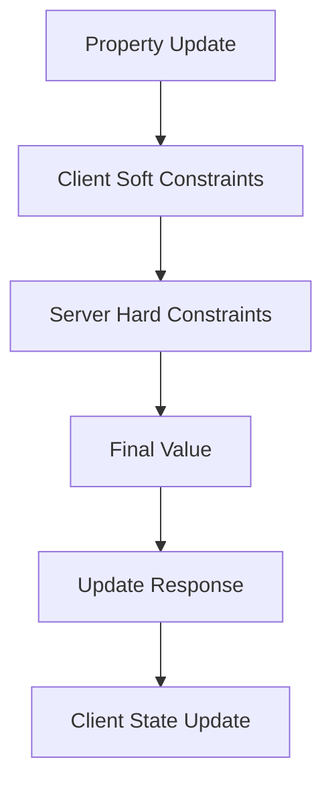
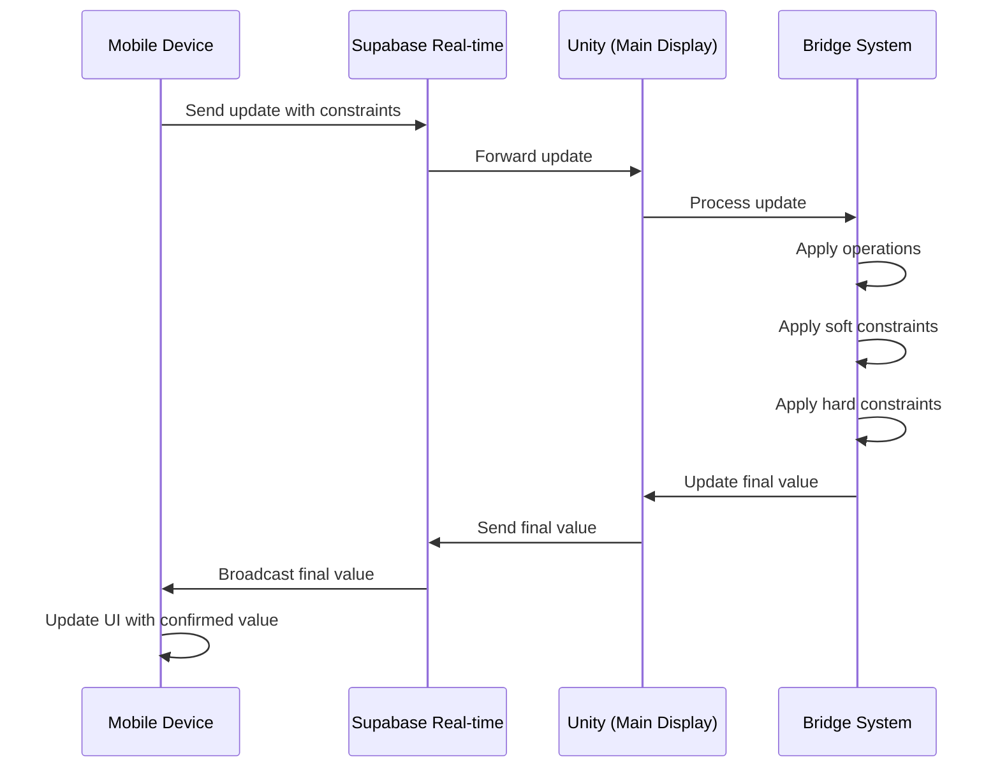

# Advanced Data Binding System

This document outlines the long-term vision for an advanced data binding system that integrates with Bridge and supports efficient state synchronization across multiple devices and platforms.

## Layered Constraint System

To provide robust data synchronization across devices, the binding system implements a layered constraint approach that maintains both flexibility and data integrity:



### Constraint Types

The binding system supports two primary types of constraints:

1. **Soft Constraints** (Client-specified)
   - Optionally provided by clients during updates
   - Allow for responsive UI feedback
   - Can be overridden by hard constraints
   - Useful for input validation and formatting
   - Specified by clients at update time

2. **Hard Constraints** (Server-enforced)
   - Defined on the server/Unity side
   - Always applied after soft constraints
   - Guarantee data integrity rules
   - Cannot be bypassed by clients
   - Typically address security and business rules
   - Registered once in the system

### Implementation Example

#### Client-Side Implementation

```javascript
// Client-side update with soft constraints
bridge.updateObject(world.player, {
  "component:Character/health": { 
    "_expr_": {
      "op": "add", 
      "value": 50,
      "constraints": [{ type: "clamp", min: 0, max: 100 }], // Soft constraints
      "reportUpdate": true // Request final value after constraints
    }
  }
});

// Mobile controller with local prediction
function adjustHealth(amount) {
  // Apply soft constraint locally for responsive UI
  const currentHealth = playerState.health;
  const softConstrained = Math.min(Math.max(0, currentHealth + amount), 100);
  
  // Update UI immediately with soft constraint
  updateHealthUI(softConstrained);
  
  // Send update with constraint info
  channel.send({
    type: 'broadcast',
    event: 'update',
    payload: {
      objectId: 'player',
      path: 'component:Character/health',
      expression: {
        op: 'add',
        value: amount,
        constraints: [{ type: "clamp", min: 0, max: 100 }],
        reportUpdate: true
      }
    }
  });
}
```

#### Server-Side Implementation

```csharp
// Server-side hard constraints registry
public class ConstraintRegistry
{
    private static Dictionary<string, List<JObject>> _hardConstraints = new Dictionary<string, List<JObject>>
    {
        // Path-based constraints
        { "component:Character/health", new List<JObject> {
            JObject.FromObject(new { type = "clamp", min = 0, max = 150 }) // Hard max of 150
        }},
        { "transform/position/y", new List<JObject> {
            JObject.FromObject(new { type = "min", value = 0 }) // Can't go below ground
        }}
    };

    public static List<JObject> GetHardConstraints(string path)
    {
        if (_hardConstraints.TryGetValue(path, out var constraints))
            return constraints;
        return new List<JObject>();
    }
}
```

#### Update Processing Flow

```csharp
// In the Bridge system's UpdateObject method
private void UpdateObject(string objectId, string path, JToken value)
{
    // Parse and process expression values
    if (value is JObject jobject && jobject.ContainsKey("_expr_"))
    {
        var expr = jobject["_expr_"] as JObject;
        var targetPropertyType = GetPropertyType(objectId, path);
        var currentValue = GetPropertyValue(objectId, path);
        
        // Only process operations for numeric types
        if (IsNumericType(targetPropertyType))
        {
            // Apply the operation
            var op = expr["op"].ToString();
            var opValue = expr["value"].ToObject(targetPropertyType);
            var reportUpdate = expr["reportUpdate"]?.ToObject<bool>() ?? false;
            
            // Calculate new value based on operation
            var newValue = ApplyOperation(currentValue, op, opValue);
            
            // Apply soft constraints (from client)
            if (expr["constraints"] is JArray softConstraints)
            {
                newValue = ApplyConstraints(newValue, softConstraints);
            }
            
            // Apply hard constraints (from server)
            var hardConstraints = ConstraintRegistry.GetHardConstraints(path);
            if (hardConstraints.Any())
            {
                newValue = ApplyConstraints(newValue, hardConstraints);
            }
            
            // Set the final value
            SetPropertyValue(objectId, path, newValue);
            
            // Send update response if requested
            if (reportUpdate)
            {
                SendUpdateResponse(objectId, path, newValue);
            }
            
            return;
        }
    }
    
    // Normal update handling for non-operation values
    SetPropertyValue(objectId, path, value);
}
```

## Operation Grammar

The system defines a focused set of operations for data manipulation, avoiding the slippery slope of evolving into a full programming language while providing essential data manipulation capabilities:

### Numeric Operations

```javascript
// Addition
{ "_expr_": { "op": "add", "value": 10 } }

// Subtraction
{ "_expr_": { "op": "sub", "value": 5 } }

// Multiplication
{ "_expr_": { "op": "mul", "value": 2 } }

// Division
{ "_expr_": { "op": "div", "value": 2 } }
```

### String Operations

```javascript
// Concatenation
{ "_expr_": { "op": "concat", "value": " World" } }

// Replacement
{ "_expr_": { "op": "replace", "pattern": "old", "value": "new" } }

// Type coercion for polymorphic fields
{ "_expr_": { 
  "op": "coerce", 
  "type": "string", 
  "value": ["line 1", "line 2"],
  "join": "\n"
} }
```

### Collection Operations

```javascript
// Add to collection
{ "_expr_": { "op": "append", "value": newItem } }

// Remove from collection
{ "_expr_": { "op": "remove", "where": { "id": 123 } } }

// Filter collection
{ "_expr_": { "op": "filter", "predicate": { "type": "weapon" } } }
```

## Constraint Types

The constraint system supports a variety of constraint types for different data scenarios:

```javascript
// Numeric constraints
{ type: "clamp", min: 0, max: 100 }
{ type: "min", value: 0 }
{ type: "max", value: 100 }
{ type: "round", precision: 2 }

// String constraints
{ type: "maxLength", value: 50 }
{ type: "pattern", regex: "^[A-Za-z0-9]+$" }
{ type: "trim" }

// Collection constraints
{ type: "uniqueBy", property: "id" }
{ type: "maxItems", value: 10 }
```

## Update Response System

The Update Response system provides feedback on the final values after constraints have been applied:

```javascript
// Client sends update with reportUpdate flag
bridge.updateObject('player', {
  "component:Character/health": {
    "_expr_": {
      "op": "add",
      "value": 50,
      "constraints": [{ type: "clamp", min: 0, max: 100 }],
      "reportUpdate": true  // Request final value after constraints
    }
  }
});

// Client receives updated value
bridge.registerUpdateHandler((updatedValues) => {
  console.log("Server confirmed health is now:", updatedValues["component:Character/health"]);
  // Update UI with the confirmed value
  updateUI(updatedValues);
});
```

On the server side, the system collects and reports back the final values:

```csharp
private void SendUpdateResponse(string objectId, Dictionary<string, object> finalValues)
{
    var response = new JObject();
    response["type"] = "updateResponse";
    response["objectId"] = objectId;
    response["values"] = JObject.FromObject(finalValues);
    
    // Send back to the client
    bridge.SendToJavaScript(response);
}
```

## Supabase Integration

### Real-Time Synchronization Architecture

The data binding system can be integrated with Supabase for multi-device real-time updates:



### Binding Data Across Devices

The integration enables synchronized state across multiple clients:

```javascript
// Unity side - connect Bridge object to Supabase
bridge.bindWithSupabase('player', {
  channel: 'game-session-123',
  paths: {
    "component:Character/health": {
      hardConstraints: [{ type: "clamp", min: 0, max: 150 }],
      reportUpdates: true
    },
    "transform/position": {
      hardConstraints: [
        { type: "min", path: "y", value: 0 } // Keep above ground
      ]
    }
  }
});

// Mobile controller - update with operation
mobileChannel.send({
  type: 'broadcast',
  event: 'update',
  payload: {
    objectId: 'player',
    path: 'component:Character/health',
    expression: {
      op: 'add',
      value: -10, // Damage
      constraints: [{ type: "clamp", min: 0, max: 100 }],
      reportUpdate: true
    }
  }
});
```

## Implementation Considerations

While this system provides powerful data handling capabilities, it's important to maintain balance:

1. **Avoid Feature Creep**: Resist adding too many specialized operations
2. **Keep it Declarative**: Focus on describing _what_ to change, not _how_
3. **Transparent Execution**: Operations should be predictable and easy to understand
4. **Prioritize Common Patterns**: Implement the most frequently used operations first
5. **Documentation**: Clearly document all operations and constraints

## Future Enhancements

Looking ahead, the binding system could be enhanced with:

1. **Schema Validation**: Define and enforce data schemas for objects
2. **Transaction Support**: Group multiple updates into atomic transactions
3. **History and Undo**: Track changes for undo/redo capability
4. **Custom Operation Registry**: Allow registration of domain-specific operations
5. **Advanced Conflict Resolution**: Merge strategies for concurrent updates
6. **Offline Support**: Queue updates when offline for later synchronization

## Performance Optimization

For high-performance scenarios, consider:

1. **Binary Protocol Options**: Alternative to JSON for performance-critical paths
2. **Compute Shaders**: Offload constraint calculations to GPU for large datasets
3. **Batched Updates**: Group updates to minimize message overhead
4. **Hierarchical Interest Management**: Only sync relevant objects to each client

This constraint-based binding system creates a robust foundation for multi-device applications while maintaining data integrity and consistency. 