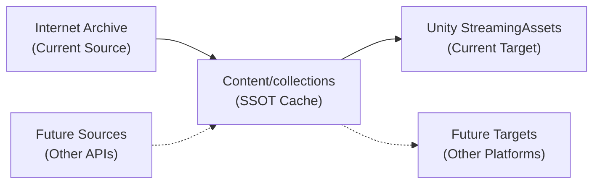
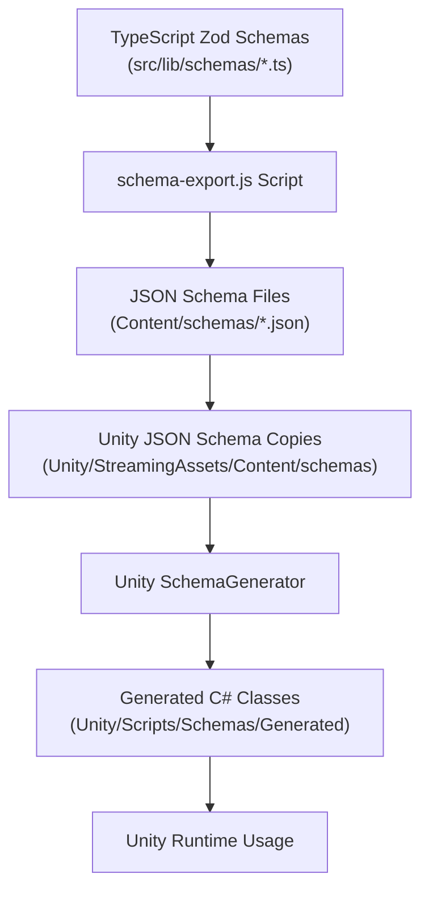
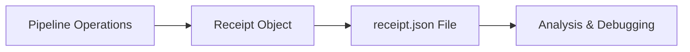
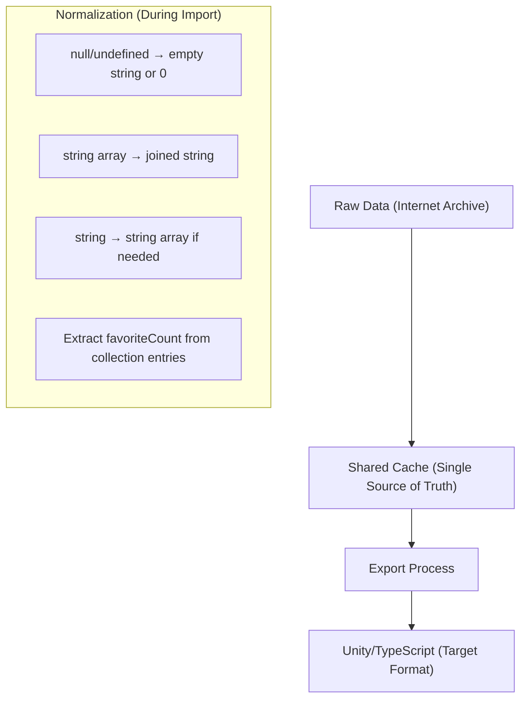
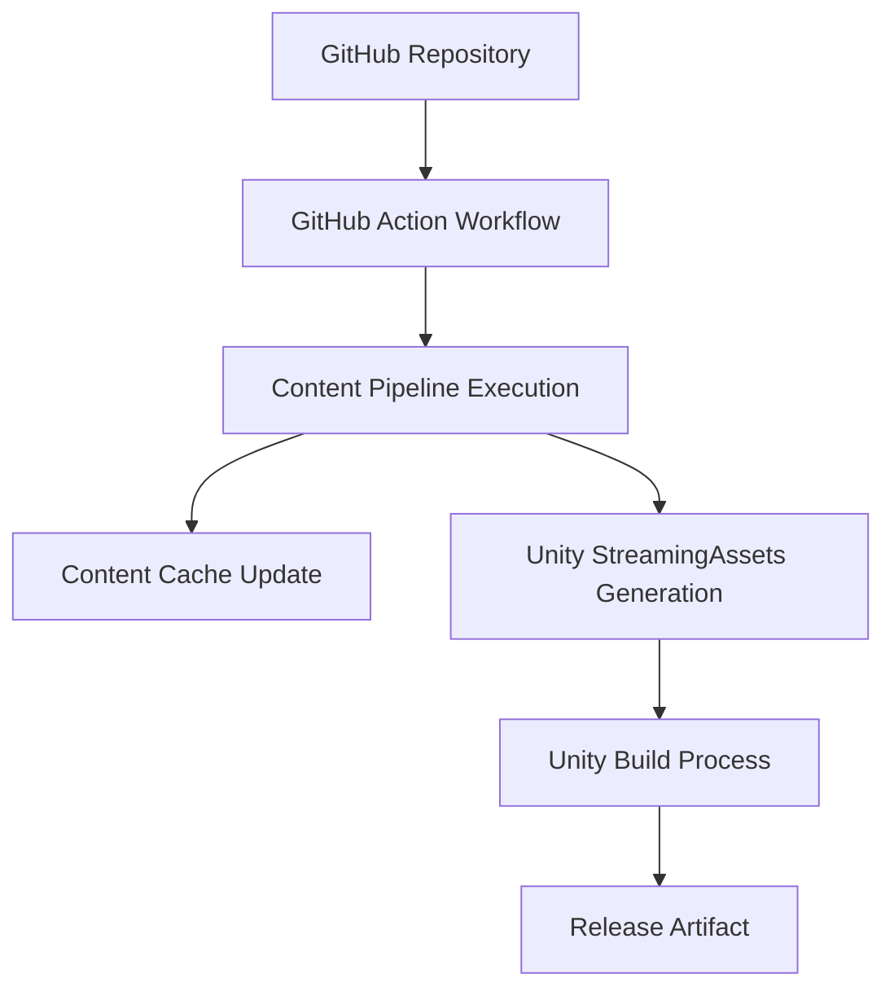
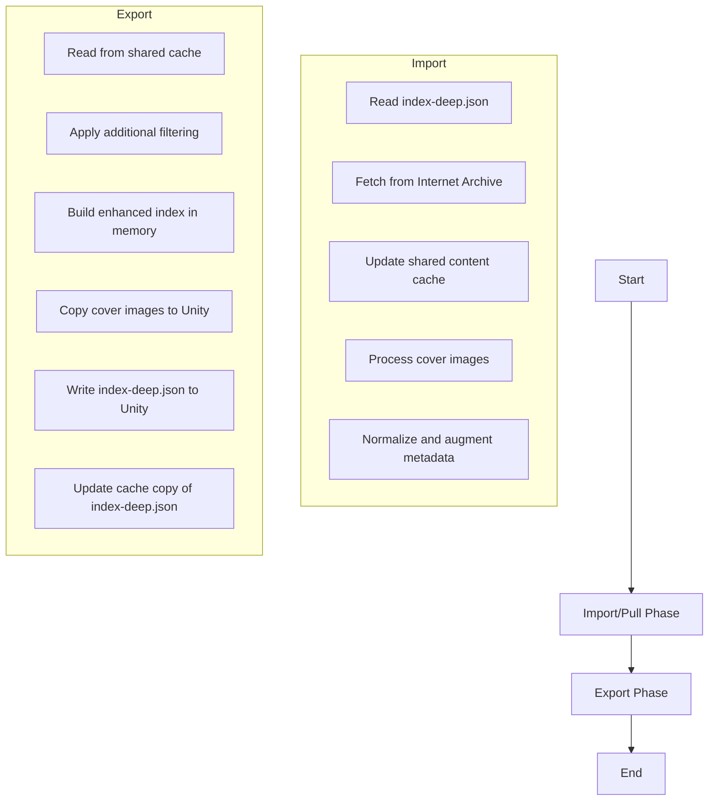
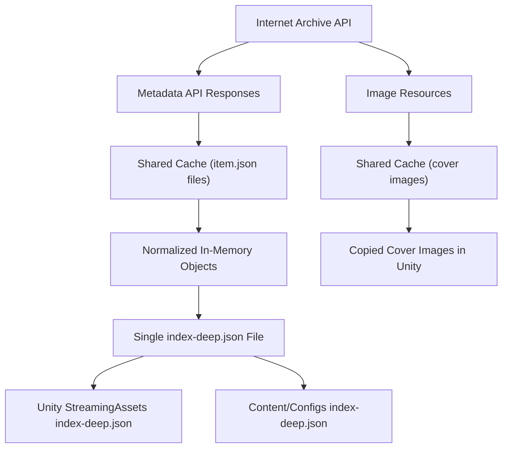

# Content Pipeline Design

## Overview

The Content Pipeline is a modular system with two primary functions:
1. **Importing** content from Internet Archive to a centralized cache directory
2. **Exporting** from that cache to Unity's StreamingAssets directory

The architecture follows a two-pass approach with the Content/collections directory serving as a Single Source of Truth (SSOT) cache, implemented in a consolidated `pipeline.js` file.

The design supports future extensions with additional importer and exporter modules beyond Internet Archive and Unity.

## Architecture



The pipeline operates in two distinct phases:

1. **Import/Pull**: Fetch content from sources (currently Internet Archive) to the shared SSOT cache (non-destructive)
2. **Export**: Create application-specific output (currently Unity) from the shared cache (can be destructive)

### Consolidated Design

The pipeline is implemented in a single file with a unified modular architecture:

- `pipeline.js` - Core pipeline class with extensible import and export functionality
- No bootstrap phase - whitelist comes from manually created `index-deep.json`
- Fully asynchronous design suitable for web server integration
- Idempotent operations with proper error handling
- Modular approach supporting multiple importers and exporters via configuration

### Intended Uses

The pipeline is designed to support multiple use cases:

1. **Command-line tool**: Run from npm scripts for content preparation
2. **Web server integration**: Can be called directly from server endpoints
3. **Development workflows**: Supports incremental updates for efficient iteration
4. **Production deployment**: Create complete content sets for distribution

## Directory Structure

```
Content/
├── Configs/
│   └── Exporters/
│       └── Unity/
│           └── CraftSpace/
│               ├── collections-filter.json  # Additional filtering rules
│               └── index-deep.json          # Item whitelist (SINGLE SOURCE OF TRUTH)
│
├── collections/  # Shared content cache
│   └── scifi/
│       ├── collection.json
│       └── Items/
│           └── 5thwave0000yanc/
│               ├── item.json     # Raw metadata with original structure
│               └── cover.jpg     # Downloaded cover image with measured dimensions

Unity/CraftSpace/Assets/StreamingAssets/Content/
├── collections-index.json     # Simple list of collection IDs
├── index-deep.json            # Consolidated metadata for all items
├── collections/
│   └── scifi/
│       ├── items-index.json   # Simple list of item IDs
│       └── items/
│           └── 5thwave0000yanc/
│               └── cover.jpg  # Only physical asset in Unity is the cover image
```

### Collections and Items

Content is organized into collections, each containing items:

```
Content/
  collections/
    spacecraft/
      collection.json
      Items/
        apollo11/
          item.json
          cover.jpg
        voyager/
          item.json
          cover.jpg
    parts/
      collection.json
      Items/
        engine-a/
          item.json
          cover.jpg
```

## Schema Directory and Pipeline

The content pipeline relies on schemas to ensure consistent data structures and enable type-safe code generation:

```
SvelteKit/BackSpace/
├── src/
│   └── lib/
│       └── schemas/        # TypeScript Zod schemas (source of truth)
│           ├── item.ts     # Item schema definition
│           ├── collection.ts # Collection schema definition
│           └── index.ts    # Schema exports
│
├── scripts/
│   └── schema-export.js   # Schema export script

Content/                  # Single Source of Truth (SSOT)
├── collections/          # Content cache
├── schemas/              # Generated JSON Schema files (SSOT)
│   ├── Item.json         # JSON Schema for items
│   └── Collection.json   # JSON Schema for collections

Unity/CraftSpace/Assets/
├── StreamingAssets/
│   └── Content/
│       └── schemas/       # Unity JSON Schema copies
│           ├── Item.json
│           └── Collection.json
│
├── Scripts/
│   └── Schemas/
│       └── Generated/     # C# classes generated from schemas
│           ├── ItemSchema.cs
│           └── CollectionSchema.cs
```

### Schema Definition and Generation Flow



### Schema Pipeline Process

The schema pipeline exports type definitions from TypeScript to Unity through several steps:

1. **TypeScript Definition** - Schemas are defined using Zod in TypeScript:
   ```typescript
   // src/lib/schemas/item.ts
   import { z } from 'zod';
   
   export const itemSchema = z.object({
     id: z.string().describe('Unique identifier for the item'),
     title: z.string()
       .optional()
       .describe(`Title of the item
{"UnitySchemaConverter":"StringOrNullToStringConverter"}`),
     // ... additional fields
   });
   
   export type Item = z.infer<typeof itemSchema>;
   ```

2. **Schema Export** - The `schema-export.js` script:
   ```javascript
   // scripts/schema-export.js
   async function exportSchemas() {
     // Import Zod schemas from TypeScript
     const { itemSchema, collectionSchema } = await import('../src/lib/schemas/index.js');
     
     // Convert to JSON Schema
     const itemJsonSchema = zodToJsonSchema(itemSchema);
     
     // Extract converter annotations from description fields
     processSchemaAnnotations(itemJsonSchema);
     
     // Write directly to SSOT schemas directory
     await fs.writeJSON('../Content/schemas/Item.json', itemJsonSchema, { spaces: 2 });
     
     // Copy to Unity StreamingAssets
     await fs.copy('../Content/schemas/Item.json', 
       '../Unity/CraftSpace/Assets/StreamingAssets/Content/schemas/Item.json');
   }
   ```

3. **JSON Schema** - The exported schema with annotations:
   ```json
   {
     "type": "object",
     "properties": {
       "id": {
         "type": "string",
         "description": "Unique identifier for the item"
       },
       "title": {
         "type": ["string", "null"],
         "description": "Title of the item",
         "x_meta": {
           "UnitySchemaConverter": "StringOrNullToStringConverter"
         }
       }
     }
   }
   ```

4. **Unity Schema Generator** - Custom editor tool that:
   - Reads JSON Schema files from StreamingAssets/Content/schemas
   - Parses converter annotations from `x_meta` properties
   - Generates C# classes with appropriate converter attributes
   - Creates validation methods based on schema constraints

### Schema Updates

The schema pipeline is executed when:

1. **Schema definitions change** - When Zod schemas are modified in TypeScript
2. **Running npm script** - Manually via `npm run schema:export`
3. **Pre-build step** - Automatically before Unity builds
4. **CI/CD pipeline** - As part of automated builds

This ensures that Unity always has the latest schema definitions and generated classes.

## Data Structure

The content whitelist (`index-deep.json`) is the SINGLE SOURCE OF TRUTH for what items should be included in the export. It follows this structure:

```json
{
  "collections": {
    "scifi": {
      "collection": { ... },  // Contents of collection.json
      "itemsIndex": ["5thwave0000yanc", ...],  // List of item IDs - WHITELIST
      "items": {
        "5thwave0000yanc": {
          "item": { ... }  // Example/template of item.json structure
        }
      }
    }
  },
  "collectionsIndex": ["scifi", ...]  // List of collection IDs - WHITELIST
}
```

### Current Implementation

Currently, `itemsIndex` is a simple array of strings representing the item IDs to include. This serves as a basic whitelist. The pipeline will:

1. Only include collections listed in `collectionsIndex`
2. Only include items listed in each collection's `itemsIndex` 

### Future Evolution

In future versions, the `itemsIndex` structure will evolve to support more complex operations:

```json
{
  "collections": {
    "scifi": {
      "itemsIndex": {
        "type": "tree",
        "include": ["*"],
        "exclude": ["wip-*", "deprecated-*"],
        "filter": {
          "property": "mediatype",
          "value": "texts"
        },
        "sort": {
          "property": "date",
          "direction": "desc"
        },
        "augment": {
          "coverWidth": 600,
          "coverHeight": 900
        }
      }
    }
  }
}
```

This more sophisticated structure will allow for:
- Complex inclusion/exclusion patterns
- Property-based filtering
- Custom sorting
- Data augmentation

However, the current implementation focuses on the simple array-based whitelist approach.

## Configuration Files

### index-deep.json

This file defines the content structure that will be exported to Unity, including:

- `collectionsIndex`: Array of collection IDs that should be included
- `collections`: Object containing metadata for each collection
  - Each collection contains an `itemsIndex` array listing item IDs to include

The importer behavior with this structure:
- Collections listed in `collectionsIndex` will be created if missing
- Collections not listed in `collectionsIndex` will be removed
- For each collection, items listed in its `itemsIndex` will be included
- Items not listed in `itemsIndex` will be excluded

### collections-filter.json

This configuration file provides additional filtering controls:

```json
{
  "version": "1.0",
  "description": "Filter configuration for exporting collections and items",
  "collections": {
    "spacecraft": {
      "enabled": true,
      "include": ["*"],
      "exclude": ["wip-*", "deprecated-*"]
    },
    "parts": {
      "enabled": true,
      "include": ["*"],
      "exclude": ["test-*"]
    }
  },
  "metadata": {
    "includeImages": true,
    "includeVideos": true,
    "includeModels": true,
    "includeSounds": true
  }
}
```

- `enabled`: Controls whether a collection is exported
- `include`: List of patterns for items to include (wildcards supported)
- `exclude`: List of patterns for items to exclude (wildcards supported)

## Two-Pass Pipeline Approach

### 1. Import/Pull Phase (Non-destructive)

The import phase updates the shared content cache in a non-destructive manner:

```javascript
async pull() {
  // Load whitelist from index-deep.json
  // For each collection and item:
  //   - Create/update collection metadata
  //   - Download item metadata if needed
  //   - Download cover images
  //   - Measure image dimensions and augment metadata
  //   - Apply initial filtering based on collections-filter.json
}
```

Key features of the import phase:
- **Caching**: Uses timestamps and ETags to avoid unnecessary downloads
- **Efficient updates**: Only updates what has changed
- **Non-destructive**: Preserves existing content
- **Basic filtering**: Applies initial filtering based on configuration
- **Image processing**: Downloads and measures cover images
- **Data augmentation**: Adds metadata like image dimensions

### 2. Export Phase (Can be destructive)

The export phase creates application-specific content from the shared cache:

```javascript
async export() {
  // Load whitelist from index-deep.json
  // Clean Unity StreamingAssets if requested
  // For each collection and item:
  //   - Apply additional filtering based on collections-filter.json
  //   - Read normalized data from the cache
  //   - Build enhanced index structure in memory
  //   - Copy cover images to Unity StreamingAssets
  //   - Write consolidated index-deep.json
}
```

Key features of the export phase:
- **Application-specific**: Creates Unity-specific content
- **Can be destructive**: Can clean output directory before export
- **Additional filtering**: Applies more restrictive filtering
- **Data consolidation**: Builds complete metadata structure in memory
- **Asset copying**: Only copies cover images to Unity directories
- **Centralized metadata**: Writes single index-deep.json with all metadata

## Async Design for Web Server Integration

The pipeline uses modern async/await patterns throughout:

```javascript
// Example of async pattern for fetching an item
async fetchItem(collectionId, itemId, options = {}) {
  // Check cache first
  if (existingItem && !this.force && !options.forceRefresh) {
    return existingItem;
  }

  // Fetch from source
  const itemData = await this.fetchFromSource(itemId);
  
  // Process cover image
  await this.processCoverImage(itemId, coverFile);
  
  // Save to cache
  await fs.writeJSON(itemFile, itemData, { spaces: 2 });
  
  return itemData;
}
```

Benefits of this design:
- **Web server integration**: Can be called from API endpoints
- **Parallel processing**: Uses Promise.all for concurrent operations
- **Proper error handling**: Catches and reports errors without crashing
- **Statistics tracking**: Provides detailed operation metrics

## Cache Mechanism

The pipeline uses an efficient caching mechanism:

- **Shared Cache**: Located at `Content/collections`, shared by multiple exporters
- **Timestamps**: Track when content was last updated
- **ETags**: Detect when content has changed
- **Selective Fetching**: Only download content that is new or changed

## Receipt System

The pipeline implements a comprehensive "receipt" system that tracks detailed metrics and logs throughout the entire process:



### Receipt Structure

The receipt follows a big-endian naming convention to improve organization and analysis:

```javascript
{
  // Download metadata
  "download_date": "2023-05-15T12:34:56Z",
  "download_ipAddress": "192.168.1.1",
  "download_name": "developer1",
  "download_geoLocation": "San Francisco, CA",
  
  // API metrics
  "api_calls_total": 250,
  "api_bandwidth_bytesDownloaded": 1572864,
  "api_performance_avgResponseTime": 320,
  
  // Cover metrics 
  "cover_download_count": 128,
  "cover_download_totalBytes": 8388608,
  "cover_download_avgSpeed": 1.5,
  
  // Collection metrics
  "collection_processed_count": 2,
  "collection_exported_count": 2,
  
  // Item metrics
  "item_processed_count": 128,
  "item_filtered_count": 12,
  "item_exported_count": 116,
  
  // Error and warning logs
  "error_count": 2,
  "error_list": [
    {
      "timestamp": "2023-05-15T12:40:23Z",
      "function": "fetchItemMetadata",
      "message": "Failed to fetch metadata",
      "collectionId": "scifi",
      "itemId": "item123"
    }
  ],
  
  // Performance metrics
  "perf_importPhase_totalTime": 45200,
  "perf_exportPhase_totalTime": 12300,
  "perf_network_totalTime": 42100,
  "perf_processing_totalTime": 15400
}
```

### Key Naming Convention

Receipt keys follow a structured, big-endian naming convention:

```
domain_conceptGroup_specificAttribute
```

- **Primary grouping by domain** (`api_`, `cover_`, etc.)
- **Secondary grouping by concept** (`download_`, `processed_`, etc.)
- **Specific attributes with camelCase** for compound concepts

This naming strategy ensures that when alphabetically sorted, related keys are grouped together, making patterns and issues easier to spot.

### Integration with Logging

The receipt system is integrated with the logger, collecting metrics and logs throughout the pipeline process:

```javascript
// Example logging with receipt metrics
logger.info("Processing collection", { 
  function: "processCollection", 
  collectionId: "scifi" 
});

// Increment metrics
logger.increment("api_calls_total");
logger.add("api_bandwidth_bytesDownloaded", responseSize);

// Record error with context
logger.error("Failed to fetch metadata", error, {
  function: "fetchItemMetadata",
  collectionId: "scifi",
  itemId: "item123"
});
```

### Receipt File Output

The receipt is automatically written to a JSON file alongside the `index-deep.json` file:

- **Main export folder**: `receipt.json` 
- **StreamingAssets folder**: Copy of `receipt.json` if StreamingAssets path is configured

The filename can be configured in the exporter configuration file:

```json
{
  "indexDeepFileName": "index-deep.json",
  "receiptFileName": "receipt.json"
}
```

### Receipt Use Cases

The receipt system serves multiple purposes:

1. **Performance analysis**: Identify bottlenecks in the pipeline
2. **Error tracking**: Consolidated record of all errors and warnings
3. **Metrics collection**: Quantitative data about pipeline operations
4. **Audit trail**: Record of who ran the pipeline and when
5. **Debugging**: Rich context for troubleshooting issues
6. **Quality assurance**: Tracking coverage and completeness of content
7. **LLM analysis**: Structured data for AI-powered analysis and optimization

## Schema and Type Conversion System

### Type Conversion Pattern

The pipeline implements a robust type conversion system to normalize polymorphic Internet Archive data into strict types for Unity:



1. **Raw Data** - Original Internet Archive metadata with polymorphic types:
   - Properties can be null, undefined, string, or array of strings
   - Descriptions can be missing, null, string, or array of strings
   - Collection IDs may include entries with "fav-" prefix

2. **Normalized Data** - Transformed data with consistent typing:
   - String properties: null/undefined → empty string
   - Array properties: null/undefined → empty array, string → single-item array
   - Descriptions: array of strings → single string (joined with newlines)
   - favoriteCount: calculated from collections with "fav-" prefix

### Schema Annotation

Zod schemas are annotated with converter information using the description field:

```typescript
title: z.string()
  .optional()
  .describe(`Title of the item
{"UnitySchemaConverter":"StringOrNullToStringConverter"}`), // Converter name in JSON metadata

description: z.union([z.string(), z.array(z.string())])
  .optional()
  .describe(`Description of the item
{"UnitySchemaConverter":"StringOrArrayOrNullToStringConverter"}`),

collection: z.union([z.string(), z.array(z.string())])
  .optional()
  .describe(`Collections this item belongs to.
{"UnitySchemaConverter":"StringArrayOrNullToStringArrayConverter"}`),
```

### Type Converter Naming

Converters follow a descriptive naming convention:

- `StringOrNullToStringConverter` - Converts null/undefined/string to string
- `StringArrayOrNullToStringArrayConverter` - Converts null/undefined/string/array to string array
- `StringOrArrayOrNullToStringConverter` - Converts null/undefined/string/array to string

### Schema Export Process

The schema-export.js script:
1. Reads Zod schemas from TypeScript files
2. Extracts converter names from `.describe()` annotations
3. Injects these names into `x_meta` properties in JSON Schema
4. Writes the JSON Schema files to Unity's schema directory

```typescript
// Example of exported JSON Schema with x_meta properties
{
  "type": "object",
  "properties": {
    "title": {
      "type": ["string", "null"],
      "description": "Title of the item",
      "x_meta": {
        "UnitySchemaConverter": "StringOrNullToStringConverter"
      }
    },
    "description": {
      "anyOf": [
        { "type": "string" },
        { "type": "array", "items": { "type": "string" } },
        { "type": "null" }
      ],
      "description": "Description of the item",
      "x_meta": {
        "UnitySchemaConverter": "StringOrArrayOrNullToStringConverter"
      }
    }
  }
}
```

### Unity C# Code Generation

The Unity schema generator (in Assets/Editor/SchemaGenerator/SchemaGenerator.cs) is designed specifically to avoid IL2CPP/WebGL compatibility issues by strictly forbidding reflection-based serialization:

```
// From SchemaGenerator README.md
// ABSOLUTELY FORBIDDEN TECHNIQUES:
// ⛔ [JsonProperty] attribute - FORBIDDEN (reflection-based)
// ⛔ [JsonConverter] attribute - FORBIDDEN (reflection-based activation)
// ⛔ JToken.ToObject<T>() - CRASHES IN WEBGL/IL2CPP
// ⛔ JToken.FromObject(obj) - CRASHES IN WEBGL/IL2CPP
```

Instead, the generator creates code that:

1. **Uses Direct Manual Processing**: The generated code manually processes JSON properties without any reflection:

   ```csharp
   // Actual code from generated ItemSchema.cs:
   protected override void ImportKnownProperties(JObject json)
   {
       // Processing property 'id'
       if (json["id"] != null)
       {
           try
           {
               _id = json["id"].ToString();
           }
           catch (Exception ex) { Debug.LogError($"Error converting 'id' directly: {ex.Message}"); }
       }
   
       // Processing property 'title'
       if (json["title"] != null)
       {
           try
           {
               _title = json["title"].ToString();
           }
           catch (Exception ex) { Debug.LogError($"Error converting 'title' directly: {ex.Message}"); }
       }
       
       // More property processing...
   }
   ```

2. **Implements Manual JSON Construction**: Export is also handled through direct property assignment without using reflection:

   ```csharp
   // IL2CPP-safe implementation with no reflection:
   protected override JObject ExportKnownProperties()
   {
       var json = new JObject();
       
       // Processing property 'id'
       if (_id != null)
       {
           try
           {
               // Direct JValue creation - NO reflection
               json["id"] = new JValue(_id);
           }
           catch (Exception ex) { Debug.LogError($"Error converting 'id' directly: {ex.Message}"); }
       }
       
       // More property export...
       
       return json;
   }
   ```

3. **Property Definition Without Attributes**: Properties are defined without any reflection-based attributes:

   ```csharp
   // Actual code from ItemSchema.cs - NO JsonConverter or JsonProperty attributes:
   /// <summary>
   /// Title of the item
   /// Schema Path: title
   /// UnitySchemaConverter: StringOrNullToStringConverter
   /// </summary>
   [SerializeField] private string _title = string.Empty;
   public string Title { get { return _title; } set { _title = value; } }
   ```

4. **Converter Information in Comments Only**: Converter information is kept in comments rather than using attributes:

   ```csharp
   /// Schema Path: title
   /// UnitySchemaConverter: StringOrNullToStringConverter
   ```

5. **HasDefinedProperty Implementation**: Schema classes implement explicit property checking:

   ```csharp
   // Actual code from CollectionSchema.cs:
   protected override bool HasDefinedProperty(string name)
   {
       switch (name)
       {
           case "id":
           case "title":
           case "description":
           // other properties...
           case "extraFields":
               return true;
           default:
               return false;
       }
   }
   ```

These techniques ensure the generated code avoids ALL reflection-based serialization techniques that would cause critical WebGL/IL2CPP compatibility issues. The implementation explicitly warns against JsonProperty attributes, JsonConverter attributes, and reflection-based methods like ToObject<T> which WILL CRASH in WebGL builds.

## Future Extensions

The pipeline is designed to be extended with advanced features:

### Content Pre-rendering

Future versions will support pre-rendering of content:
- **Text extraction**: Extract plain text content from documents
- **Markdown conversion**: Convert rich text to markdown
- **HTML rendering**: Generate HTML snippets for web display
- **Data visualization**: Create preview charts and graphs

### Image Processing

Advanced image handling features:
- **Atlas generation**: Combine multiple images into efficient atlases
- **Tile pyramid generation**: Create image tiles for efficient zooming
- **Image optimization**: Resize and compress images for target platforms
- **Thumbnail generation**: Create consistent thumbnails in multiple sizes

### Metadata Enrichment

Enhanced metadata capabilities:
- **AI-powered tagging**: Automatically generate descriptive tags
- **Semantic analysis**: Extract topics and concepts from content
- **Cross-referencing**: Link related items across collections
- **Custom fields**: Support for application-specific metadata

### Content Organization

Improved content organization features:
- **Hierarchical categories**: Support nested category structures
- **Dynamic collections**: Create collections based on metadata queries
- **Flexible sorting**: Support custom sort orders based on any field
- **Search optimization**: Generate search indexes for efficient querying

## Pipeline Commands

```
node scripts/pipeline.js run       # Run the complete pipeline (pull + export) 
node scripts/pipeline.js pull      # Only pull content from sources to cache
node scripts/pipeline.js export    # Only export from cache to Unity
```

Options:
- `--verbose` or `-v`: Enable detailed logging
- `--clean`: Clean destination directories before operation
- `--force` or `-f`: Force operation, overwriting existing files

## GitHub Actions Integration

The pipeline is designed to integrate with GitHub Actions for automated execution in CI/CD workflows:



### Automated Content Updates

Content can be automatically updated through GitHub Actions by:

1. **Scheduled runs**: Regular polling for new content
   ```yaml
   # .github/workflows/content-update.yml
   on:
     schedule:
       - cron: '0 0 * * *'  # Daily at midnight
   jobs:
     update-content:
       runs-on: ubuntu-latest
       steps:
         - uses: actions/checkout@v3
         - uses: actions/setup-node@v3
         - run: npm ci
         - run: npm run pipeline:run
         - name: Commit changes
           uses: EndBug/add-and-commit@v9
           with:
             message: "Auto-update content cache"
             add: "Content/collections/* Content/Configs/Exporters/*/index-deep.json"
   ```

2. **Manual triggers**: On-demand content updates
   ```yaml
   # .github/workflows/manual-content-update.yml
   on:
     workflow_dispatch:
       inputs:
         collections:
           description: 'Space-separated list of collections to update'
           required: false
   ```

3. **Content change detection**: Updating based on whitelist changes
   ```yaml
   # .github/workflows/whitelist-based-update.yml
   on:
     push:
       paths:
         - 'Content/Configs/Exporters/*/index-deep.json'
   ```

### CI/CD Pipeline Integration

The content pipeline can be integrated into the project's CI/CD workflow:

1. **Pre-build content validation**: Ensuring content is properly structured
   ```yaml
   jobs:
     validate-content:
       runs-on: ubuntu-latest
       steps:
         - uses: actions/checkout@v3
         - uses: actions/setup-node@v3
         - run: npm ci
         - run: npm run validate-content
   ```

2. **Unity build integration**: Ensuring latest content is included in builds
   ```yaml
   jobs:
     build-unity:
       needs: validate-content
       runs-on: unity-runner
       steps:
         - uses: actions/checkout@v3
         - name: Export fresh content
           run: npm run pipeline:export
         - name: Build Unity project
           uses: game-ci/unity-builder@v2
   ```

3. **Release automation**: Preparing content for distribution
   ```yaml
   jobs:
     prepare-release:
       runs-on: ubuntu-latest
       steps:
         - uses: actions/checkout@v3
         - run: npm run pipeline:run -- --clean
         - name: Package content
           run: npm run package-content
   ```

### Receipt-Based Actions

The pipeline's receipt system enables intelligent GitHub Action workflows:

1. **Error handling**: Automatically create issues for pipeline errors
   ```yaml
   - name: Check for pipeline errors
     run: node scripts/check-receipt.js
     id: receipt-check
   - name: Create issue for errors
     if: steps.receipt-check.outputs.has_errors == 'true'
     uses: JasonEtco/create-an-issue@v2
     with:
       filename: .github/ISSUE_TEMPLATE/pipeline-error.md
   ```

2. **Content reports**: Generate summary reports of content changes
   ```yaml
   - name: Generate content report
     run: node scripts/generate-report.js
   - name: Post report comment
     uses: actions/github-script@v6
     with:
       script: |
         const fs = require('fs');
         const report = fs.readFileSync('./content-report.md', 'utf8');
         github.rest.issues.createComment({
           issue_number: context.issue.number,
           owner: context.repo.owner,
           repo: context.repo.repo,
           body: report
         });
   ```

## Key Principles

1. **Two-pass Architecture**: Separate import (non-destructive) and export (can be destructive)
2. **Single Source of Truth**: Shared cache serves as the central content repository
3. **Idempotent Operations**: Can run multiple times with consistent results
4. **Async Design**: Compatible with web server and API integration
5. **Whitelist-Driven**: The `index-deep.json` file controls what gets included
6. **Type Conversion System**: Normalizes polymorphic data to strict types
7. **Schema-Driven Generation**: Automatically generates C# code with proper converters

## Pipeline Flow



## Refined Data Flow Model

The pipeline follows a consolidated data flow model where metadata is centralized and physical assets are distributed:



### Key Architecture Points:

1. **Import Phase Behavior**:
   - Metadata is fetched from Internet Archive API
   - Each item's metadata is normalized with type conversions and favoriteCount calculation
   - Cover images are downloaded from the standardized URL pattern `https://archive.org/services/img/{itemId}`
   - Item metadata and cover images are stored in the content cache (`Content/collections/...`)

2. **Export Phase Behavior**:
   - No individual item.json or collection.json files are written to Unity
   - All item metadata is read from the cache, then aggregated into the in-memory enhanced index
   - Only cover image files are copied to the Unity StreamingAssets directories
   - The complete metadata structure is written once as a consolidated index-deep.json file

3. **Dual Index-Deep.json System**:
   - The enhanced index is written to two locations:
     1. Unity StreamingAssets directory: `Unity/CraftSpace/Assets/StreamingAssets/Content/index-deep.json`
     2. Config cache directory: `Content/Configs/Exporters/Unity/CraftSpace/index-deep.json`
   - This maintains a single source of truth while ensuring both locations have the latest data

4. **Metadata Structure**:
   - Item metadata is normalized during import (once only)
   - Favorite counts are calculated from collection entries starting with `fav-` prefix
   - Type conversions ensure consistent data types for Unity consumption
   - Cover image information includes both source URL and dimension data

5. **Asset Structure**:
   - Cover images are the only physical files copied to Unity directories
   - Directory structure in Unity mirrors the structure in the cache
   - Source URLs are preserved in the index to allow clients to choose between cached or source images

### Directory Content Summary:

```
Unity/CraftSpace/Assets/StreamingAssets/Content/
├── index-deep.json        # All metadata consolidated in one file
├── collections-index.json # Simple list of collection IDs
├── collections/
│   └── scifi/
│       ├── items-index.json # Simple list of item IDs
│       └── items/
│           └── 5thwave0000yanc/
│               └── cover.jpg # Only physical asset file, no item.json
```

This architecture provides several advantages:
1. **Efficiency**: Reduces file I/O operations significantly
2. **Consistency**: Ensures metadata is synchronized across all locations
3. **Performance**: Clients can load all metadata in a single request
4. **Flexibility**: Clients can choose between cached and source assets
5. **Simplicity**: Clear separation between metadata and physical assets

## Implementation

The pipeline is implemented as a unified Node.js script in `scripts/pipeline.js`:

1. **Idempotent operation**: Can be run multiple times with the same result
2. **Respect whitelist**: Only pulls and exports items listed in `index-deep.json`
3. **Efficient caching**: Avoids downloading unchanged content
4. **Type conversion**: Normalizes data types for Unity consumption
5. **Async design**: Uses modern async/await patterns throughout
6. **Error handling**: Properly catches and reports errors without crashing
7. **Statistics tracking**: Provides detailed metrics about operations

The script is invoked via npm commands defined in `package.json`:

```
npm run pipeline:run       # Run full pipeline
npm run pipeline:pull      # Only pull content
npm run pipeline:export    # Only export content
```

5. **Generated C# Classes** - Type-safe Unity classes:
   ```csharp
   // Unity/Scripts/Schemas/Generated/ItemSchema.cs
   [System.Serializable]
   public class ItemSchema : SchemaGeneratedObject
   {
       // WARNING: This is an auto-generated class. DO NOT MODIFY DIRECTLY.
       // If changes are needed, modify the schema generator instead.

       /// <summary>
       /// Unique identifier for the item
       /// Schema Path: id
       /// UnitySchemaConverter: StringOrNullToStringConverter
       /// </summary>
       [SerializeField] private string _id = string.Empty;
       public override string Id { get { return _id; } set { _id = value; } }

       /// <summary>
       /// Title of the item
       /// Schema Path: title
       /// UnitySchemaConverter: StringOrNullToStringConverter
       /// </summary>
       [SerializeField] private string _title = string.Empty;
       public string Title { get { return _title; } set { _title = value; } }
       
       // Additional properties follow the same pattern - NO JsonProperty or JsonConverter attributes
   }
   ```