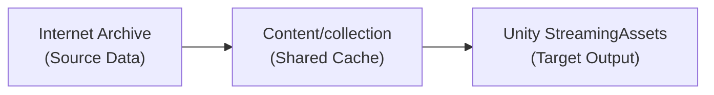
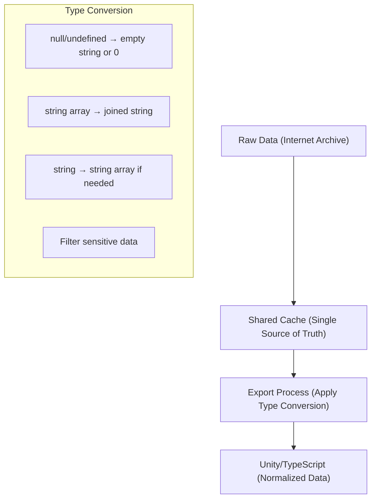
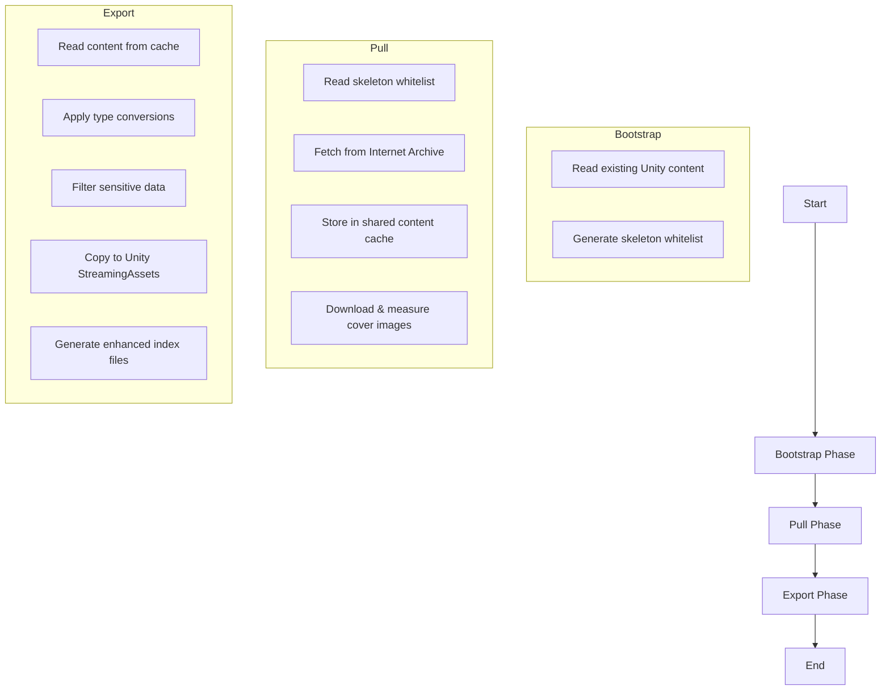

# Content Pipeline Design

## Overview

The Content Pipeline is a system for exporting content from Internet Archive to Unity's StreamingAssets directory. The pipeline follows a pull-based approach with efficient caching.

## Architecture



The pipeline operates in three stages:

1. **Bootstrap**: Generate a skeleton whitelist from existing Unity content
2. **Pull**: Fetch content from Internet Archive to a shared content cache
3. **Export**: Export cached content to Unity StreamingAssets

## Directory Structure

```
Content/
├── Configs/
│   └── Exporters/
│       └── Unity/
│           └── CraftSpace/
│               ├── collections-filter.json  # Filter configuration
│               └── index-deep.json          # Skeleton whitelist
│
├── collections/  # Shared content cache (SINGLE SOURCE OF TRUTH)
│   └── scifi/
│       ├── collection.json
│       └── Items/
│           └── 5thwave0000yanc/
│               ├── item.json     # Raw metadata with original structure
│               └── cover.jpg     # Downloaded cover image with measured dimensions

Unity/CraftSpace/Assets/StreamingAssets/Content/
├── collections-index.json
├── index-deep.json  # Enhanced with additional metadata
├── collections/
│   └── scifi/
│       ├── collection.json
│       ├── items-index.json
│       └── items/
│           └── 5thwave0000yanc/
│               ├── item.json     # Cleaned, filtered, and normalized metadata
│               └── cover.jpg
```

## Data Structure

The skeleton whitelist (`index-deep.json`) follows this structure:

```json
{
  "collections": {
    "scifi": {
      "collection": { ... },  // Contents of collection.json
      "itemsIndex": ["5thwave0000yanc", ...],  // List of item IDs
      "items": {
        "5thwave0000yanc": {
          "item": { ... }  // Contents of item.json
        }
      }
    }
  },
  "collectionsIndex": ["scifi", ...]  // List of collection IDs
}
```

## Cache Mechanism

The pipeline uses an efficient caching mechanism:

- **Shared Cache**: Located at `Content/collections`, shared by multiple exporters
- **Timestamps**: Track when content was last updated
- **ETags**: Detect when content has changed
- **Selective Fetching**: Only download content that is new or changed

## Schema and Type Conversion System

### Type Conversion Pattern

The pipeline implements a robust type conversion system to normalize polymorphic Internet Archive data into strict types for Unity:



1. **Raw Data** - Original Internet Archive metadata with polymorphic types:
   - Properties can be null, undefined, string, or array of strings
   - Descriptions can be missing, null, string, or array of strings
   - Collection IDs may include sensitive "fav-username" entries

2. **Normalized Data** - Cleaned data with strict typing for Unity/TypeScript:
   - String properties: null/undefined → empty string
   - Array properties: null/undefined → empty array, string → single-item array
   - Descriptions: array of strings → single string (joined with newlines)
   - Social data: "fav-username" entries are filtered out

### Schema Annotation

Zod schemas are annotated with converter information using the description field:

```typescript
title: z.string()
  .optional()
  .describe(`Title of the item
{"UnitySchemaConverter":"StringOrNullToStringConverter"}`), // Converter name in JSON metadata

description: z.union([z.string(), z.array(z.string())])
  .optional()
  .describe(`Description of the item
{"UnitySchemaConverter":"StringOrArrayOrNullToStringConverter"}`),

collection: z.union([z.string(), z.array(z.string())])
  .optional()
  .describe(`Collections this item belongs to.
{"UnitySchemaConverter":"StringArrayOrNullToStringArrayConverter"}`),
```

### Type Converter Naming

Converters follow a descriptive naming convention:

- `StringOrNullToStringConverter` - Converts null/undefined/string to string
- `StringArrayOrNullToStringArrayConverter` - Converts null/undefined/string/array to string array
- `StringOrArrayOrNullToStringConverter` - Converts null/undefined/string/array to string

### Schema Export Process

The schema-export.js script:
1. Reads Zod schemas from TypeScript files
2. Extracts converter names from `.describe()` annotations
3. Injects these names into `x_meta` properties in JSON Schema
4. Writes the JSON Schema files to Unity's schema directory

```typescript
// Example of exported JSON Schema with x_meta properties
{
  "type": "object",
  "properties": {
    "title": {
      "type": ["string", "null"],
      "description": "Title of the item",
      "x_meta": {
        "UnitySchemaConverter": "StringOrNullToStringConverter"
      }
    },
    "description": {
      "anyOf": [
        { "type": "string" },
        { "type": "array", "items": { "type": "string" } },
        { "type": "null" }
      ],
      "description": "Description of the item",
      "x_meta": {
        "UnitySchemaConverter": "StringOrArrayOrNullToStringConverter"
      }
    }
  }
}
```

### Unity C# Code Generation

The Unity SchemaGenerator:
1. Reads JSON Schema files with `x_meta` properties
2. Generates C# classes with appropriate JsonConverter attributes
3. These converters implement the type conversion logic in C#
4. Generated C# classes include appropriate property types and converters

```csharp
// Example of generated C# class with JsonConverter attributes
public partial class Item : SchemaGeneratedObject
{
    [JsonProperty("title")]
    [JsonConverter(typeof(StringOrNullToStringConverter))]
    public string Title { get; set; }

    [JsonProperty("description")]
    [JsonConverter(typeof(StringOrArrayOrNullToStringConverter))]
    public string Description { get; set; }

    [JsonProperty("collection")]
    [JsonConverter(typeof(StringArrayOrNullToStringArrayConverter))]
    public List<string> Collection { get; set; }
}
```

### TypeScript Implementation

In the SvelteKit application, similar converters are implemented for client/server code:

```typescript
// Example TypeScript converter implementation
export function stringOrNullToString(value: string | null | undefined): string {
  if (value === null || value === undefined) return '';
  return value;
}

export function stringArrayOrNullToStringArray(
  value: string | string[] | null | undefined
): string[] {
  if (value === null || value === undefined) return [];
  return Array.isArray(value) ? value : [value];
}

export function stringOrArrayOrNullToString(
  value: string | string[] | null | undefined
): string {
  if (value === null || value === undefined) return '';
  return Array.isArray(value) ? value.join('\n') : value;
}
```

### Cover Image Handling

The pipeline also processes cover images:
1. Downloads cover images to `Content/collections/{collectionId}/items/{itemId}/cover.jpg`
2. Measures image dimensions
3. Adds `coverWidth` and `coverHeight` properties to item.json
4. During export, copies these images to Unity

## Pipeline Commands

```
pipeline:bootstrap  # Generate skeleton whitelist from existing Unity content
pipeline:pull       # Pull content from Internet Archive to cache
pipeline:export     # Export content from cache to Unity
pipeline:run        # Run the complete pipeline (bootstrap, pull, export)
```

## Key Principles

1. **Pull-Based Architecture**: Configuration-driven pull from source to cache to target
2. **Shared Caching Layer**: Multiple exporters can share the same content cache
3. **Efficient Updates**: Use timestamps and ETags for optimized caching
4. **1:1 Filesystem Mapping**: Directory structure mirrors JSON structure
5. **Separation of Concerns**: Clear distinction between bootstrap, pull, and export phases
6. **Type Conversion System**: Normalizes polymorphic data to strict types
7. **Schema-Driven Generation**: Automatically generates C# code with proper converters

## Pipeline Flow



## Implementation

The pipeline is implemented as a set of Node.js scripts in the `Scripts` directory:

- `pipeline-bootstrap.js`: Generate the skeleton whitelist
- `pipeline-pull.js`: Pull content from Internet Archive to cache
- `pipeline-export.js`: Export content from cache to Unity
- `pipeline-run.js`: Run the complete pipeline

These scripts are invoked via npm commands defined in `package.json`. 