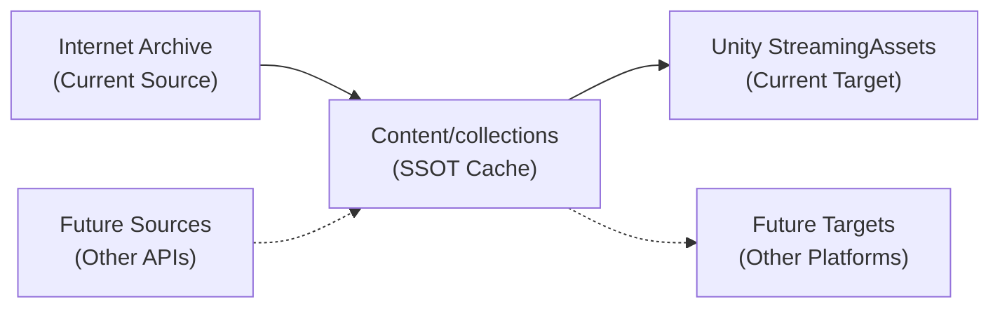
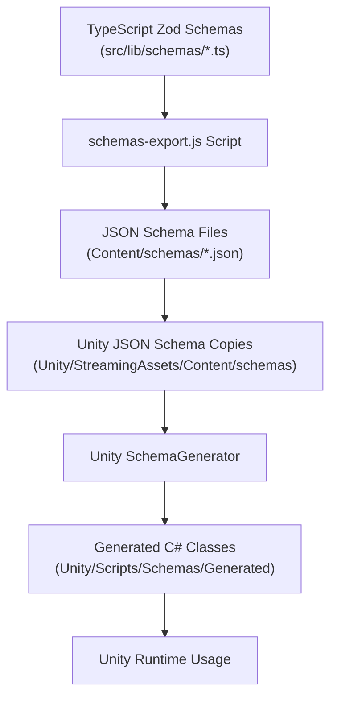
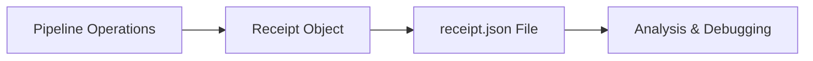
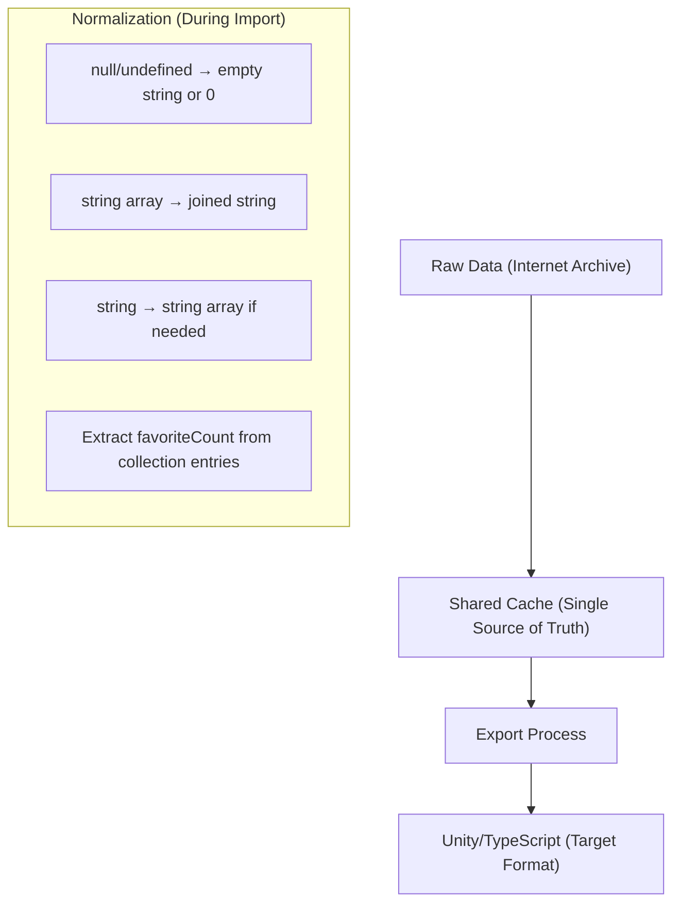
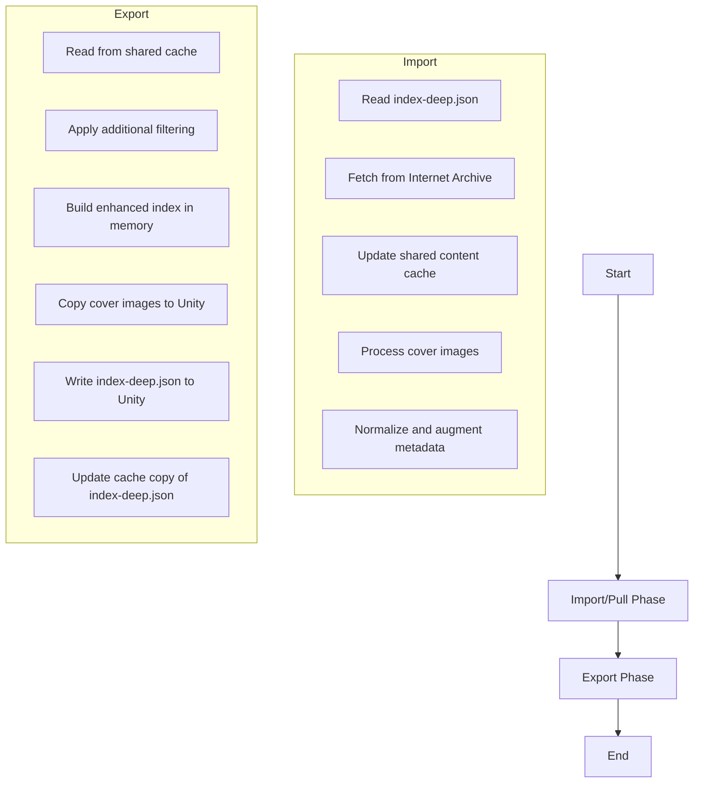

# Content Pipeline Design

## Overview

The Content Pipeline is a modular system with two primary functions:
1. **Importing** content from Internet Archive to a centralized cache directory
2. **Exporting** from that cache to Unity's StreamingAssets directory

The architecture follows a two-pass approach with the Content/collections directory serving as a Single Source of Truth (SSOT) cache, implemented in a consolidated `pipeline.js` file.

The design supports future extensions with additional importer and exporter modules beyond Internet Archive and Unity.

## Architecture



The pipeline operates in two distinct phases:

1. **Import/Pull**: Fetch content from sources (currently Internet Archive) to the shared SSOT cache (non-destructive)
2. **Export**: Create application-specific output (currently Unity) from the shared cache (can be destructive)

### Consolidated Design

The pipeline is implemented in a single file with a unified modular architecture:

- `pipeline.js` - Core pipeline class with extensible import and export functionality
- No bootstrap phase - whitelist comes from manually created `index-deep.json`
- Fully asynchronous design suitable for web server integration
- Idempotent operations with proper error handling
- Modular approach supporting multiple importers and exporters via configuration

### Intended Uses

The pipeline is designed to support multiple use cases:

1. **Command-line tool**: Run from npm scripts for content preparation
2. **Web server integration**: Can be called directly from server endpoints
3. **Development workflows**: Supports incremental updates for efficient iteration
4. **Production deployment**: Create complete content sets for distribution

## Directory Structure

```
Content/
├── Configs/
│   └── Exporters/
│       └── Unity/
│           └── CraftSpace/
│               ├── collections-filter.json  # Additional filtering rules
│               └── index-deep.json          # Item whitelist (SINGLE SOURCE OF TRUTH)
│
├── collections/  # Shared content cache
│   └── scifi/
│       ├── collection.json
│       └── Items/
│           └── 5thwave0000yanc/
│               ├── item.json     # Raw metadata with original structure
│               └── cover.jpg     # Downloaded cover image with measured dimensions

Unity/CraftSpace/Assets/StreamingAssets/Content/
├── collections-index.json     # Simple list of collection IDs
├── index-deep.json            # Consolidated metadata for all items
├── collections/
│   └── scifi/
│       ├── items-index.json   # Simple list of item IDs
│       └── items/
│           └── 5thwave0000yanc/
│               └── cover.jpg  # Only physical asset in Unity is the cover image
```

### Collections and Items

Content is organized into collections, each containing items:

```
Content/
  collections/
    spacecraft/
      collection.json
      Items/
        apollo11/
          item.json
          cover.jpg
        voyager/
          item.json
          cover.jpg
    parts/
      collection.json
      Items/
        engine-a/
          item.json
          cover.jpg
```

## Schema Directory and Pipeline

The content pipeline relies on schemas to ensure consistent data structures and enable type-safe code generation:

```
SvelteKit/BackSpace/
├── src/
│   └── lib/
│       └── schemas/        # TypeScript Zod schemas (source of truth)
│           ├── item.ts     # Item schema definition
│           ├── collection.ts # Collection schema definition
│           └── index.ts    # Schema exports
│
├── scripts/
│   └── schemas-export.js   # Schema export script

Content/                  # Single Source of Truth (SSOT)
├── collections/          # Content cache
├── schemas/              # Generated JSON Schema files (SSOT)
│   ├── Item.json         # JSON Schema for items
│   └── Collection.json   # JSON Schema for collections

Unity/CraftSpace/Assets/
├── StreamingAssets/
│   └── Content/
│       └── schemas/       # Unity JSON Schema copies
│           ├── Item.json
│           └── Collection.json
│
├── Scripts/
│   └── Schemas/
│       └── Generated/     # C# classes generated from schemas
│           ├── ItemSchema.cs
│           └── CollectionSchema.cs
```

### Schema Definition and Generation Flow



### Schema Pipeline Process

The schema pipeline exports type definitions from TypeScript to Unity through several steps:

1. **TypeScript Definition** - Schemas are defined using Zod in TypeScript
2. **Schema Export** - The `schemas-export.js` script processes schemas
3. **JSON Schema** - The exported schema with annotations
4. **Unity Schema Generator** - Custom editor tool generates C# classes

For detailed information about the schema system, see [README-SCHEMAS.md](../Notes/README-SCHEMAS.md).

### Schema Updates

The schema pipeline is executed when:

1. **Schema definitions change** - When Zod schemas are modified in TypeScript
2. **Running npm script** - Manually via `npm run schemas:export`
3. **Pre-build step** - Automatically before Unity builds
4. **CI/CD pipeline** - As part of automated builds

This ensures that Unity always has the latest schema definitions and generated classes.

## Data Structure

The content whitelist (`index-deep.json`) is the SINGLE SOURCE OF TRUTH for what items should be included in the export. It follows this structure:

```json
{
  "collections": {
    "scifi": {
      "collection": { ... },  // Contents of collection.json
      "itemsIndex": ["5thwave0000yanc", ...],  // List of item IDs - WHITELIST
      "items": {
        "5thwave0000yanc": {
          "item": { ... }  // Example/template of item.json structure
        }
      }
    }
  },
  "collectionsIndex": ["scifi", ...]  // List of collection IDs - WHITELIST
}
```

### Current Implementation

Currently, `itemsIndex` is a simple array of strings representing the item IDs to include. This serves as a basic whitelist. The pipeline will:

1. Only include collections listed in `collectionsIndex`
2. Only include items listed in each collection's `itemsIndex` 

### Future Evolution

In future versions, the `itemsIndex` structure will evolve to support more complex operations including:
- Complex inclusion/exclusion patterns
- Property-based filtering
- Custom sorting
- Data augmentation

## Configuration Files

### index-deep.json

This file defines the content structure that will be exported to Unity, including:

- `collectionsIndex`: Array of collection IDs that should be included
- `collections`: Object containing metadata for each collection
  - Each collection contains an `itemsIndex` array listing item IDs to include

The importer behavior with this structure:
- Collections listed in `collectionsIndex` will be created if missing
- Collections not listed in `collectionsIndex` will be removed
- For each collection, items listed in its `itemsIndex` will be included
- Items not listed in `itemsIndex` will be excluded

### collections-filter.json

This configuration file provides additional filtering controls for collections and items.

## Two-Pass Pipeline Approach

### 1. Import/Pull Phase (Non-destructive)

The import phase updates the shared content cache in a non-destructive manner.

Key features of the import phase:
- **Caching**: Uses timestamps and ETags to avoid unnecessary downloads
- **Efficient updates**: Only updates what has changed
- **Non-destructive**: Preserves existing content
- **Basic filtering**: Applies initial filtering based on configuration
- **Image processing**: Downloads and measures cover images
- **Data augmentation**: Adds metadata like image dimensions

### 2. Export Phase (Can be destructive)

The export phase creates application-specific content from the shared cache.

Key features of the export phase:
- **Application-specific**: Creates Unity-specific content
- **Can be destructive**: Can clean output directory before export
- **Additional filtering**: Applies more restrictive filtering
- **Data consolidation**: Builds complete metadata structure in memory
- **Asset copying**: Only copies cover images to Unity directories
- **Centralized metadata**: Writes single index-deep.json with all metadata

## Async Design for Web Server Integration

The pipeline uses modern async/await patterns throughout, providing:
- **Web server integration**: Can be called from API endpoints
- **Parallel processing**: Uses Promise.all for concurrent operations
- **Proper error handling**: Catches and reports errors without crashing
- **Statistics tracking**: Provides detailed operation metrics

## Cache Mechanism

The pipeline uses an efficient caching mechanism:

- **Shared Cache**: Located at `Content/collections`, shared by multiple exporters
- **Timestamps**: Track when content was last updated
- **ETags**: Detect when content has changed
- **Selective Fetching**: Only download content that is new or changed

## Receipt System

The pipeline implements a comprehensive "receipt" system that tracks detailed metrics and logs throughout the process:



The receipt system records a wide range of metrics including download information, API metrics, processing statistics, and error logs. This information is valuable for debugging, performance optimization, and audit purposes.

## Type Conversion System

The pipeline implements a robust type conversion system to normalize polymorphic Internet Archive data into strict types for Unity:



Type converters follow a descriptive naming convention:
- `StringOrNullToStringConverter` - Converts null/undefined/string to string
- `StringArrayOrNullToStringArrayConverter` - Converts null/undefined/string/array to string array
- `StringOrArrayOrNullToStringConverter` - Converts null/undefined/string/array to string

For more information on the schema and converter system, see [README-SCHEMAS.md](../Notes/README-SCHEMAS.md).

## Future Extensions

The pipeline is designed to be extended with advanced features:

### Content Pre-rendering
- Text extraction, markdown conversion, HTML rendering, data visualization

### Image Processing
- Atlas generation, tile pyramid generation, image optimization, thumbnail generation

### Metadata Enrichment
- AI-powered tagging, semantic analysis, cross-referencing, custom fields

### Content Organization
- Hierarchical categories, dynamic collections, flexible sorting, search optimization

## Pipeline Commands

```
node scripts/pipeline.js run       # Run the complete pipeline (pull + export) 
node scripts/pipeline.js pull      # Only pull content from sources to cache
node scripts/pipeline.js export    # Only export from cache to Unity
```

Options:
- `--verbose` or `-v`: Enable detailed logging
- `--clean`: Clean destination directories before operation
- `--force` or `-f`: Force operation, overwriting existing files

## GitHub Actions Integration

The pipeline is designed to integrate with GitHub Actions for automated execution in CI/CD workflows. This includes:

1. **Scheduled runs**: Regular polling for new content
2. **Manual triggers**: On-demand content updates 
3. **Content change detection**: Updating based on whitelist changes

### Receipt-Based Actions

The pipeline's receipt system enables intelligent GitHub Action workflows for error handling and content reports.

## Key Principles

1. **Two-pass Architecture**: Separate import (non-destructive) and export (can be destructive)
2. **Single Source of Truth**: Shared cache serves as the central content repository
3. **Idempotent Operations**: Can run multiple times with consistent results
4. **Async Design**: Compatible with web server and API integration
5. **Whitelist-Driven**: The `index-deep.json` file controls what gets included
6. **Type Conversion System**: Normalizes polymorphic data to strict types
7. **Schema-Driven Generation**: Automatically generates C# code with proper converters

## Pipeline Flow



## Implementation

The pipeline is implemented as a unified Node.js script in `scripts/pipeline.js`:

1. **Idempotent operation**: Can be run multiple times with the same result
2. **Respect whitelist**: Only pulls and exports items listed in `index-deep.json`
3. **Efficient caching**: Avoids downloading unchanged content
4. **Type conversion**: Normalizes data types for Unity consumption
5. **Async design**: Uses modern async/await patterns throughout
6. **Error handling**: Properly catches and reports errors without crashing
7. **Statistics tracking**: Provides detailed metrics about operations

The script is invoked via npm commands defined in `package.json`:

```
npm run pipeline:run       # Run full pipeline
npm run pipeline:pull      # Only pull content
npm run pipeline:export    # Only export content
```